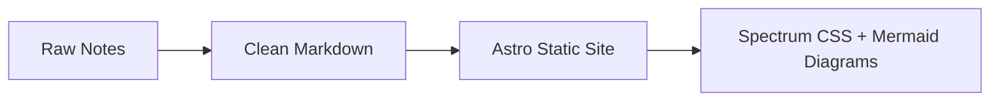

# Meteora DLMM Recap

Study notes from Meteora DLMM bootcamp sessions — structured, translated to English, and served as a static site with [Adobe Spectrum](https://opensource.adobe.com/spectrum-css/) design.

> [!NOTE]
> Raw notes live in [`notes/`](./notes/) — readable on GitHub, no build needed.

## What's Inside



| Day | Topic                          | Notes                                |
| --- | ------------------------------ | ------------------------------------ |
| 1   | DLMM Fundamentals & Strategies | [`notes/day-1.md`](./notes/day-1.md) |

## Stack

**Astro 5** + **Spectrum CSS** (tokens, typography, page, table) + **Mermaid.js 11** (client-side diagrams)

Features: dark/light toggle, sticky sidebar nav, responsive layout, auto-generated pages per day.

## Quick Start

```bash
npm install
npm run dev      # http://localhost:4321
npm run build    # static output → dist/
```

## Adding a New Day

Create `notes/day-N.md`:

```yaml
---
title: "Day N — Topic Here"
description: "Brief description"
date: "YYYY-MM-DD"
day: N
---
```

Write your notes below the frontmatter. The index page and individual day route generate automatically.

> [!TIP]
> Use ` ```mermaid ` code blocks for diagrams — they render on both GitHub and the Astro site.

---

> [!WARNING]
> Use `<br>` for line breaks in Mermaid labels, not `\n` — Astro's Shiki highlighter treats `\n` as literal text.

## Project Structure

```tree
notes/              ← Markdown notes (GitHub-readable)
src/
├── content/config.ts   ← Content collection (glob loader)
├── layouts/DocsLayout.astro
├── pages/
│   ├── index.astro     ← Day listing
│   └── [slug].astro    ← Individual day
└── styles/spectrum.css ← Markdown → Spectrum mapping
```

## Internationalization (i18n)

### Supported Languages

- **English** (`en`) — default
- **Bahasa Indonesia** (`id`)

### URL Structure

All pages are prefixed with the language code:

```text
/en/            → English homepage
/en/day-1/      → English Day 1 notes
/id/            → Indonesian homepage
/id/day-1/      → Indonesian Day 1 notes
```

### Adding a New Language

1. Create a translation file in `src/i18n/{locale}.json`:

```json
{
  "site": {
    "title": "Your Title",
    "description": "Your Description"
  },
  "nav": { ... },
  "language": {
    "switchTo": "Switch to",
    "en": "English",
    "id": "Bahasa Indonesia"
  }
}
```

1. Add the locale to `src/i18n/utils.ts`:

```ts
export const locales = ["en", "id", "your-locale"] as const;
```

1. Import and add the translation object to the `translations` constant in the same file.

### Adding Translated Content

Create separate Markdown files for each language:

```text
notes/
├── day-1.md        ← English content
├── day-1-id.md     ← Indonesian content
├── day-2.md
└── day-2-id.md
```

**File Naming Convention:**

- English: `{slug}.md` (e.g., `day-1.md`)
- Other languages: `{slug}-{locale}.md` (e.g., `day-1-id.md`)

**Frontmatter Requirements:**

```yaml
---
title: "Day 1 — Topic"
description: "Brief description"
date: "2025-02-13"
day: 1
lang: "en" # or "id"
---
```

The `lang` field is required for routing to work correctly. Content is automatically filtered by language on the index page and routed to the appropriate locale path.

### Translation File Structure

Translation files in `src/i18n/` use nested JSON objects:

```text
src/i18n/
├── en.json      ← English UI strings
├── id.json      ← Indonesian UI strings
└── utils.ts     ← Locale utilities & types
```

UI components use `getTranslations(locale)` to load the appropriate strings. The language switcher automatically toggles between available locales while preserving the current page path.

## License

MIT
