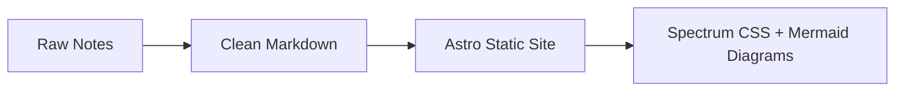

# Meteora DLMM Recap

Study notes from Meteora DLMM bootcamp sessions — structured, translated to English, and served as a static site with [Adobe Spectrum](https://opensource.adobe.com/spectrum-css/) design.

> [!NOTE]
> Raw notes live in [`notes/`](./notes/) — readable on GitHub, no build needed.

## What's Inside



| Day | Topic                          | Notes                                |
| --- | ------------------------------ | ------------------------------------ |
| 1   | DLMM Fundamentals & Strategies | [`notes/day-1.md`](./notes/day-1.md) |

## Stack

**Astro 5** + **Spectrum CSS** (tokens, typography, page, table) + **Mermaid.js 11** (client-side diagrams)

Features: dark/light toggle, sticky sidebar nav, responsive layout, auto-generated pages per day.

## Quick Start

```bash
npm install
npm run dev      # http://localhost:4321
npm run build    # static output → dist/
```

## Adding a New Day

Create `notes/day-N.md`:

```yaml
---
title: "Day N — Topic Here"
description: "Brief description"
date: "YYYY-MM-DD"
day: N
---
```

Write your notes below the frontmatter. The index page and individual day route generate automatically.

> [!TIP]
> Use ` ```mermaid ` code blocks for diagrams — they render on both GitHub and the Astro site.

----

> [!WARNING]
> Use `<br>` for line breaks in Mermaid labels, not `\n` — Astro's Shiki highlighter treats `\n` as literal text.

## Project Structure

```tree
notes/              ← Markdown notes (GitHub-readable)
src/
├── content/config.ts   ← Content collection (glob loader)
├── layouts/DocsLayout.astro
├── pages/
│   ├── index.astro     ← Day listing
│   └── [slug].astro    ← Individual day
└── styles/spectrum.css ← Markdown → Spectrum mapping
```

## License

MIT
