## Pengenalan & Konsep Inti DeFi

### Gambaran Umum Bootcamp

Sesi ini dipimpin oleh instruktur Pesal dan Megumi, menekankan bahwa semua materi hanya untuk tujuan pendidikan dan bukan merupakan saran finansial.

### Terminologi Kunci

- **TVL (Total Value Locked)** — Total modal yang disetorkan dalam sebuah protokol atau pool
- **Volume** — Aktivitas perdagangan dan arus likuiditas yang melewati sebuah pool
- **Slippage** — Perbedaan harga antara saat transaksi dimulai dan saat transaksi dieksekusi

### DLMM vs. AMM Standar

Tidak seperti AMM Standar, DLMM (Dynamic Liquidity Market Maker) memungkinkan **likuiditas terkonsentrasi**, membuat penggunaan modal menjadi lebih efisien bagi LP (Penyedia Likuiditas).

## Mekanik DLMM: Bins & Bin Step

### Memahami Bins

Likuiditas di DLMM disimpan dalam **Bins**, yang merupakan wadah harga spesifik. Pengguna dapat memegang likuiditas di dalam bin ini, baik harga saat ini sedang aktif di sana atau tidak.

**Karakteristik utama:**

- Setiap bin mewakili titik harga yang diskret (terpisah)
- Likuiditas dapat berada di bin di atas atau di bawah harga pasar saat ini
- Bin aktif mendapatkan biaya (fee) ketika perdagangan dieksekusi pada tingkat harga tersebut

### Penjelasan Bin Step

**Bin Step** adalah persentase perbedaan harga antara dua bin yang berurutan, yang mendefinisikan granularitas (tingkat ketelitian) rentang harga.

### Dampak Ukuran Bin

- **Bin Step Lebih Kecil** — Presisi lebih tinggi dan perubahan harga lebih halus
- **Bin Step Lebih Besar** — Cakupan rentang harga lebih luas tetapi dengan pergerakan harga yang lebih kasar

## Jenis Distribusi Likuiditas

Saat menyediakan likuiditas, Anda memilih bagaimana menyebarkannya di seluruh rentang harga. Ada tiga bentuk distribusi dasar:

### 1. Distribusi Spot

- **Sebaran merata** di seluruh rentang harga yang Anda pilih
- Pilihan paling serbaguna dan umum
- Titik awal yang baik untuk pemula

### 2. Distribusi Curve

- Likuiditas **terkonsentrasi** ketat di sekitar harga saat ini
- Terbaik untuk pasangan stabil dengan pergerakan harga minimal (misalnya, USDC/USDT)
- Efisiensi modal lebih tinggi di pasar yang berkisar (ranging markets)

### 3. Distribusi Bid-Ask

- Distribusi **asimetris** untuk strategi terarah (directional)
- Memungkinkan pembelian (bid) atau penjualan (ask) bertahap saat harga bergerak
- Digunakan untuk pendekatan Dollar Cost Averaging (DCA)

> **Catatan:** Hari 1 mencakup strategi lanjutan yang menggunakan distribusi ini dikombinasikan dengan analisis pasar.

### Impermanent Loss (IL)

Tujuannya adalah menghasilkan cukup biaya perdagangan (trading fees) dari volume untuk melebihi kerugian sementara dalam nilai aset yang disebabkan oleh divergensi harga.

**Konsep kunci:** IL tidak terealisasi sampai Anda menarik likuiditas. Nilai posisi berubah seiring pergerakan harga, tetapi fee terakumulasi untuk mengimbangi hal ini.

### Fokus Profitabilitas

Untuk menjadi LP yang profit:

- **Fee yang diperoleh harus melebihi "difference loss"** (impermanent loss)
- Volatilitas tinggi bisa menguntungkan **jika fee menutupi pergeseran harga**
- Fokus pada pool yang menghasilkan volume untuk memaksimalkan pendapatan fee

```mermaid
flowchart LR
    A["Posisi LP"] --> B["Volatilitas Harga<br>↕"]
    B --> C["Impermanent Loss<br>⚠"]

    A --> D["Volume Trading<br>📈"]
    D --> E["Pendapatan Fee<br>💰"]

    C --> F{"Fee > IL?"}
    E --> F

    F -->|Ya| G["✅ Posisi<br>Untung"]
    F -->|Tidak| H["⚠ Posisi<br>Rugi"]

    style G fill:#2d7d46,color:#fff
    style H fill:#c9252d,color:#fff
    style E fill:#2d7d46,color:#fff
    style C fill:#e68619,color:#fff

```

## Tur Platform & Panduan Praktis

### Tinjauan Antarmuka Meteora

Aplikasi Meteora menyediakan beberapa fitur utama untuk penyediaan likuiditas:

#### Masuk Cepat: Tombol Petir (Lightning Button)

- Zap instan ke dalam pool trending teratas
- Akses satu klik ke peluang bervolume tinggi
- Onboarding yang disederhanakan untuk pasangan populer

### Membuka Posisi

**Proses langkah demi langkah:**

1. **Hubungkan wallet** — Tautkan wallet Solana Anda (Phantom, Solflare, dll.)
2. **Pilih pasangan** — Pilih pasangan trading (misal: SOL/USDC)
3. **Pilih parameter:**

- Bin Step (granularitas harga)
- Jumlah deposit
- Bentuk distribusi likuiditas

4. **Konfirmasi transaksi** — Tinjau dan setujui

### Likuiditas Satu Sisi (Single-Sided)

Fitur utama yang memungkinkan penyediaan likuiditas hanya dengan satu token:

**Manfaat:**

- **Deposit hanya SOL** (atau hanya token) tanpa memerlukan keduanya
- Sesuaikan eksposur berdasarkan pandangan pasar
- Berguna untuk strategi terarah

**Contoh:** Jika Anda _bullish_ pada sebuah token tetapi harganya saat ini rendah, depositkan SOL saja. Saat harga naik, SOL Anda secara bertahap dikonversi menjadi token tersebut.

## Dasar-Dasar Keamanan Token

Sebelum memberikan likuiditas ke pool mana pun, **selalu riset tokennya terlebih dahulu**. Ini sangat penting untuk menghindari penipuan dan _rug pull_.

### Cek Keamanan Esensial

1. **Verifikasi alamat kontrak** — Selalu periksa sumber resmi (situs web, Twitter, CoinGecko)
2. **Pindai masalah keamanan** — Gunakan alat seperti [Rugcheck.xyz](https://rugcheck.xyz)
3. **Cek distribusi pemegang** — Gunakan [Bubblemaps](https://bubblemaps.io) untuk melihat konsentrasi yang mencurigakan
4. **Cari volume organik** — Hindari lonjakan tiba-tiba yang kemudian menghilang

### Tanda Bahaya (Red Flags) Cepat

- ❌ Kontrak yang tidak diverifikasi atau mencurigakan
- ❌ Sebagian besar token dipegang oleh beberapa wallet saja
- ❌ Janji APY yang tidak realistis (jika terlalu indah untuk menjadi kenyataan...)
- ❌ Volume yang tiba-tiba berhenti (kemungkinan _wash trading_)

### Aturan Emas untuk Pemula

1. **Mulai dari yang kecil** — Uji dengan jumlah yang Anda rela untuk kehilangan
2. **Hindari FOMO** — Jangan mengejar _pump_ tanpa analisis
3. **Tetap pada token mapan dulu** — SOL/USDC dan pasangan utama lebih aman untuk belajar
4. **Pantau posisi Anda** — Cek setiap hari, terutama saat masih belajar

> **Catatan:** Hari 1 menyediakan alur kerja keamanan terperinci, proses pemeriksaan token, dan strategi manajemen risiko tingkat lanjut.

### Sumber Daya & Komunitas

#### Bergabung dengan Komunitas

- **Meteora Discord** — Pembaruan platform resmi dan dukungan
- **LP Army Discord** — Komunitas bootcamp dan pelatihan berkelanjutan
- **Sertifikasi** — Isi formulir bootcamp untuk mendapatkan peran (role) dan akses konten tingkat lanjut

#### Langkah Selanjutnya

1. Selesaikan sesi bootcamp harian
2. Berlatih dengan posisi kecil terlebih dahulu
3. Bergabung dengan saluran Discord untuk dukungan berkelanjutan
4. Terapkan strategi secara bertahap seiring Anda belajar
