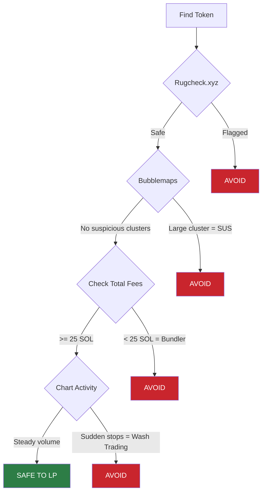
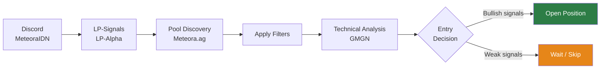
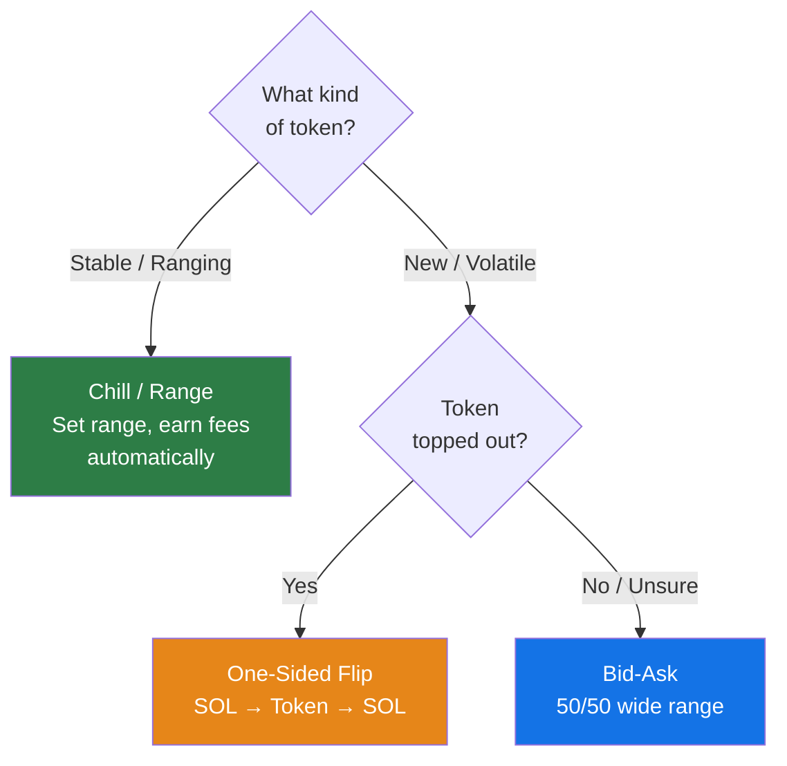
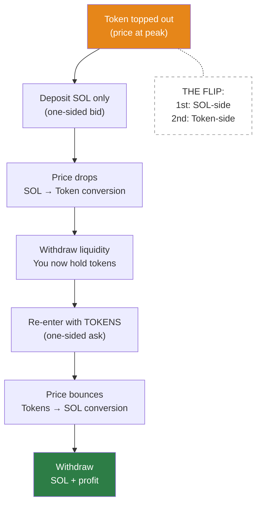

## Strategies Overview

### Mentor's Strategy

- **Wide range** distribution with 50% token / 50% SOL in a **bid-ask** layout, then **spot**

### Evil Panda's Strategy

- Go **one-sided SOL** (quote token only) at **-85% to -90%** range
- Use **wide range** distribution
- Typically in **100 bin step** pools with **5%–10% fee**
- Target pools with **high volume** — filter 1-hour volume > 100K, or for quick plays filter 5-minute volume > 100K
- _Prefer [DEX Screener](https://dexscreener.com) over GMGN for safer analysis_
- Refer to **Advanced Bootcamp #7** for detailed parameters

## Security & Tools

### Learning & Analytics

- [LP Army](https://lparmy.com) — Bootcamp platform for learning DLMM strategies
- [Metlex](https://metlex.io) — Discover trending tokens, fees, and PnL data
- [Meteora Profit Analysis](https://geeklad.github.io/meteora-profit-analysis/) — Wallet-level profit analysis
- [UltraLP](https://www.ultralp.com/) — PnL analysis tool
- [HawkFi](https://www.hawkfi.ag/) — LP management assistant
- [MetEngine](https://www.metengine.xyz/) — LP analytics tool
- [Fabriq](https://fabriq.trade/trending) — Meteora score tracker; _look for scores above 200_ (high trading volume + activity = high score)

### Security Checks

- **[Rugcheck](https://rugcheck.xyz)** — Scan tokens for rug pull indicators
- **[Bubblemaps Solana](https://bubblemaps.io)** — Visualize holder relationships
  - _Watch out for large clusters holding high percentages — signals suspicious concentration_

### Red Flags

- **Wash trading** — If chart activity suddenly stops, it's likely bot-driven volume that halted due to errors
- **Low total fees** — Avoid pools with total fees below **25 SOL** (check on GMGN); low fees often indicate a **bundler** using single-transaction orders

### Token Vetting Flow

## Token Discovery

### Discord Channels (MeteoraIDN)

#### LP-Signals

- Multiday opportunities, exotic pairs, and more

#### LP-Alpha

- **Degen Calls** — Curated picks from experienced LPs
- **Multiday Degens** — Tokens with potential for multi-day positions
- **Degen DLMM** — High-risk, high-reward opportunities

### Discovery Flow

### Pool Discovery (on Meteora.ag)

Recommended filters:

- **Jupiter Score** >= 70
- **Market Cap** >= 250K
- **Holders** >= 500
- **Pool type** — DLMM only
- **Volume** >= 1K (or 24H volume >= 1M)

### Technical Analysis (use GMGN)

1. **MACD** — Blue crosses above orange = bullish; orange crosses above blue = bearish
2. **RSI** — Standard overbought/oversold signals
3. **Heikin Ashi candles** — Smoothed candlesticks for clearer trend visualization
4. **Volume Profile Visible Range (VPVR)** — Chart overlay showing volume distribution at each price level

## DLMM Strategies

### Strategy Selection Guide

### Bid-Ask Explained

A **bid-ask** strategy means buying or selling incrementally across a price range, rather than all at once.

### One-Sided Flip Strategy

1. Deposit **SOL only** (one-sided) — you _expect the price to drop_
2. As the price drops, your SOL gradually buys the token at decreasing prices — think of it as "I want to buy this token, but in small increments"
3. Best used when a token appears to have **topped out**
4. Once the price has dropped and your SOL has converted to tokens, **withdraw liquidity**
5. Re-enter with the **acquired tokens** (one-sided token deposit), now expecting a bounce
6. This is the **flip** — first SOL-side, then token-side

### Chill / Range Strategy

- Best for **stable or ranging tokens** where you can identify a reliable price range
- Set your range and let the position earn fees as price oscillates within it
- No manual flipping needed — the position automatically earns as price moves within range

## Tips & Rules

### Earnings Expectations

- **20–30% daily return on 1 SOL** is achievable, but _only with a conservative, safe approach_

### Risk Management

- **Evil Panda's rule of thumb**: Prioritize **total fees** and **volume** above all other metrics
- Total fees generated is a reliable proxy for overall pool quality — it covers most of your analysis
- _Research first, ape later_

### Position Sizing

- Better to go **single-side SOL** — when you sense the top, deploy immediately
- Combine with **MACD + VPVR** and other indicators for timing
- Define your lifestyle: a **1 SOL bid-ask** position is a solid starting point

### Fee Guidelines

- **Old tokens** (3+ days): Wide range up to 90%, fee at **2%** is safe
- **New tokens**: Use **5–10% fee** pools

### Timeframe Reference

- **Yunus's timeframe**: 15-minute candles / 30-second intervals
- **Multiday** = hold for days; **Multihour** = hold for hours

### Cut-Loss Rules

- Wrong token pick, oversized bundle, bad chart read — **cut immediately**
- Exit signal triggered but price dumps — _stay consistent, don't hesitate_

### Timing Rules

- _Do not open positions in the afternoon (2–3 PM)_ — you'd have to close them in the morning
- **Open at 10–11 PM** when the chart is still near **ATH**
