## Introduction & Core DeFi Concepts

### Bootcamp Overview

Session led by instructors Pesal and Megumi, emphasizing that all material is for educational purposes and not financial advice.

### Key Terminology

- **TVL (Total Value Locked)** — Total capital deposited in a protocol or pool
- **Volume** — Trading activity and liquidity flow through a pool
- **Slippage** — Price difference between when a transaction is initiated and when it's executed

### DLMM vs. Standard AMM

Unlike Standard AMMs, the DLMM (Dynamic Liquidity Market Maker) allows for **concentrated liquidity**, making capital usage more efficient for LPs.

## DLMM Mechanics: Bins & Bin Steps

### Understanding Bins

Liquidity in DLMM is stored in **Bins**, which are specific price containers. Users can hold liquidity in these bins whether the current price is active there or not.

**Key characteristics:**

- Each bin represents a discrete price point
- Liquidity can exist in bins above or below the current market price
- Active bins earn fees when trades execute at their price level

### Bin Steps Explained

The **Bin Step** is the percentage difference in price between two consecutive bins, defining the granularity of the price range.

### Impact of Bin Size

- **Smaller Bin Step** — Higher precision and smoother price changes
- **Larger Bin Step** — Wider price range coverage but with coarser price movements

## Liquidity Distribution Types

When providing liquidity, you choose how to spread it across the price range. There are three basic distribution shapes:

### 1. Spot Distribution

- **Uniform spread** across your selected price range
- Most versatile, general-purpose option
- Good starting point for beginners

### 2. Curve Distribution

- **Concentrated** liquidity tightly around current price
- Best for stable pairs with minimal price movement (e.g., USDC/USDT)
- Higher capital efficiency in ranging markets

### 3. Bid-Ask Distribution

- **Asymmetric** distribution for directional strategies
- Allows gradual buying (bid) or selling (ask) as price moves
- Used for Dollar Cost Averaging (DCA) approaches

> **Note:** Day 1 covers advanced strategies that use these distributions in combination with market analysis.

### Impermanent Loss (IL)

The goal is to generate enough trading fees from volume to outweigh the temporary loss in asset value caused by price divergence.

**Key concept:** IL is not realized until you withdraw liquidity. The position value changes as prices move, but fees accumulate to offset this.

### Profitability Focus

To be a profitable LP:

- **Fees earned must exceed the "difference loss"** (impermanent loss)
- High volatility can be beneficial **if fees cover the price shifts**
- Focus on volume-generating pools to maximize fee income

```mermaid
flowchart LR
    A["LP Position"] --> B["Price Volatility<br>↕"]
    B --> C["Impermanent Loss<br>⚠"]
    
    A --> D["Trading Volume<br>📈"]
    D --> E["Fee Income<br>💰"]
    
    C --> F{"Fees > IL?"}
    E --> F
    
    F -->|Yes| G["✅ Profitable<br>Position"]
    F -->|No| H["⚠ Losing<br>Position"]
    
    style G fill:#2d7d46,color:#fff
    style H fill:#c9252d,color:#fff
    style E fill:#2d7d46,color:#fff
    style C fill:#e68619,color:#fff
```

## Platform Tour & Practical Walkthrough

### Meteora Interface Overview

The Meteora app provides several key features for liquidity provision:

#### Quick Entry: Lightning Button

- Instantly zap into top trending pools
- One-click access to high-volume opportunities
- Streamlined onboarding for popular pairs

### Opening a Position

**Step-by-step process:**

```mermaid
flowchart TD
    A["Start"] --> B["Connect Wallet<br>Phantom, Solflare, etc."]
    B --> C["Select Trading Pair<br>e.g., SOL/USDC"]
    C --> D["Choose Bin Step<br>Price granularity"]
    D --> E["Set Deposit Amount<br>Token quantity"]
    E --> F["Select Distribution<br>Spot/Curve/Bid-Ask"]
    F --> G["Single or Dual Side?"]
    
    G -->|Single-sided| H["Deposit SOL only<br>or Token only"]
    G -->|Dual-sided| I["Deposit both<br>SOL + Token"]
    
    H --> J["Review & Confirm"]
    I --> J
    J --> K["Position Active<br>⚡ Earning Fees"]
    
    style A fill:#888,color:#fff
    style K fill:#2d7d46,color:#fff
```

1. **Connect wallet** — Link your Solana wallet (Phantom, Solflare, etc.)
2. **Select pair** — Choose trading pair (e.g., SOL/USDC)
3. **Choose parameters:**
   - Bin Step (price granularity)
   - Deposit amount
   - Liquidity distribution shape
4. **Confirm transaction** — Review and approve

### Single-Sided Liquidity

A key feature that allows providing liquidity with only one token:

**Benefits:**

- **Deposit only SOL** (or only the token) instead of requiring both
- Customize exposure based on market views
- Useful for directional strategies

**Example:** If you're bullish on a token but it's currently at a low price, deposit SOL only. As price rises, your SOL gradually converts to the token.

## Token Safety Basics

Before providing liquidity to any pool, **always research the token first**. This is critical to avoid scams and rug pulls.

### Essential Safety Checks

1. **Verify the contract address** — Always check official sources (website, Twitter, CoinGecko)
2. **Scan for security issues** — Use tools like [Rugcheck.xyz](https://rugcheck.xyz)
3. **Check holder distribution** — Use [Bubblemaps](https://bubblemaps.io) to spot suspicious concentration
4. **Look for organic volume** — Avoid sudden spikes that disappear

### Quick Red Flags

- ❌ Unverified or suspicious contracts
- ❌ Most tokens held by a few wallets
- ❌ Unrealistic APY promises (if it's too good to be true...)
- ❌ Volume that suddenly stops (likely wash trading)

### Golden Rules for Beginners

1. **Start small** — Test with amounts you're comfortable losing
2. **Avoid FOMO** — Don't chase pumps without analysis
3. **Stick to established tokens first** — SOL/USDC and major pairs are safer for learning
4. **Monitor your positions** — Check daily, especially when learning

> **Note:** Day 1 provides detailed security workflows, token vetting processes, and advanced risk management strategies.

### Resources & Community

#### Join the Community

- **Meteora Discord** — Official platform updates and support
- **LP Army Discord** — Bootcamp community and ongoing coaching
- **Certification** — Complete bootcamp form to earn roles and access advanced content

#### Next Steps

1. Complete daily bootcamp sessions
2. Practice with small positions first
3. Join Discord channels for ongoing support
4. Apply strategies incrementally as you learn
