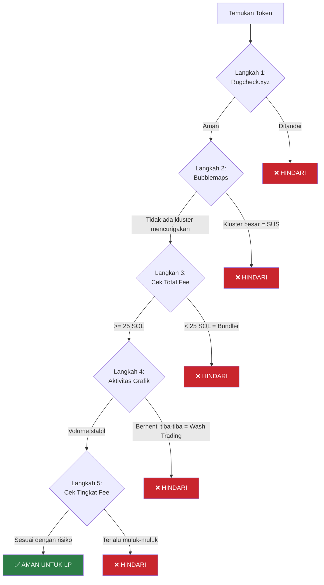
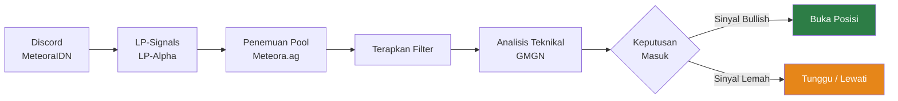
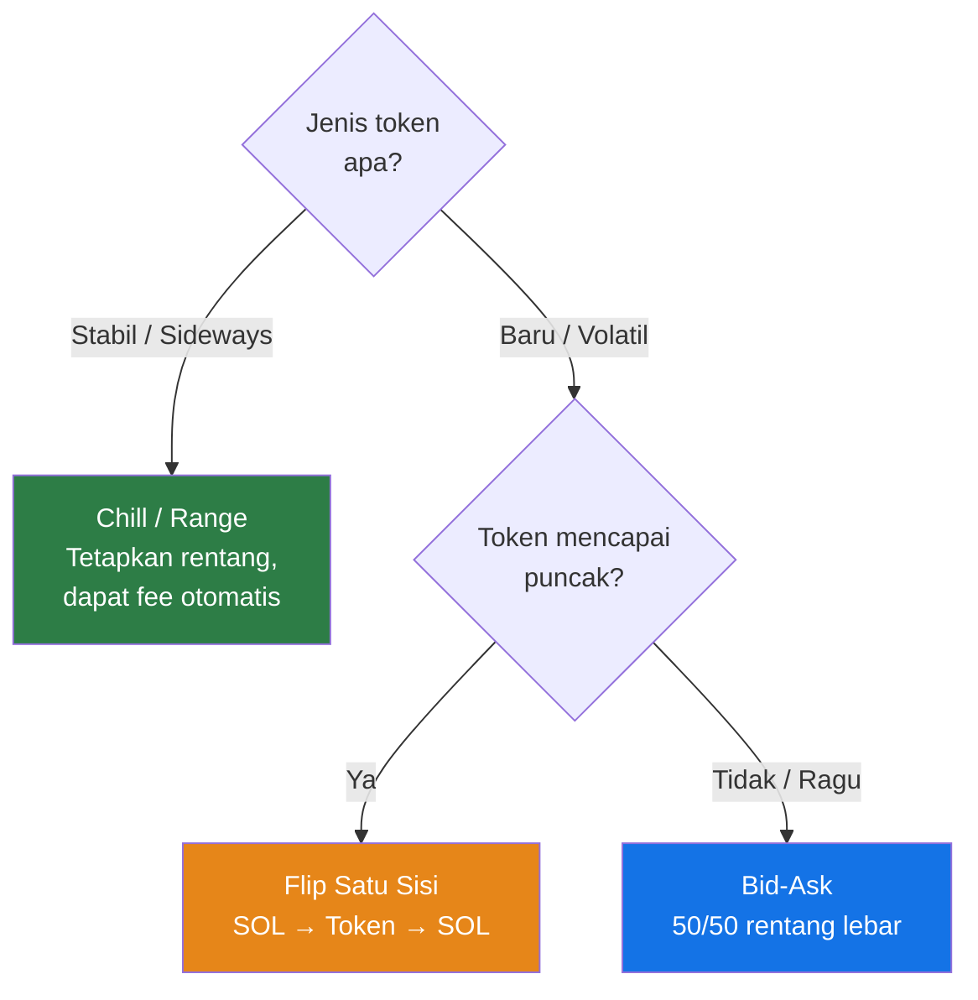
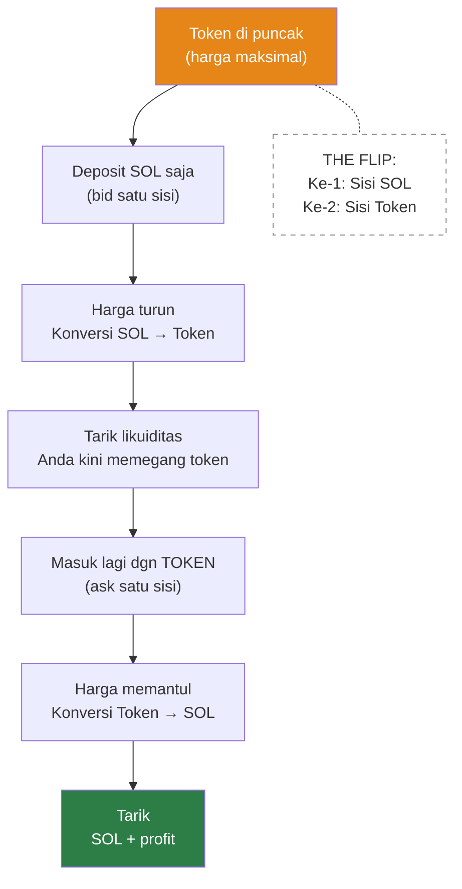

> **Prasyarat:** Panduan ini mengasumsikan Anda telah menyelesaikan Hari 1 dan memahami dasar-dasar DLMM (bin, distribusi, impermanent loss).

## Gambaran Umum Strategi Lanjutan

### Strategi Mentor

- Distribusi **rentang lebar (wide range)** dengan 50% token / 50% SOL dalam tata letak **bid-ask**, lalu **spot**

### Strategi Evil Panda

- Gunakan **satu sisi (one-sided) SOL** (hanya token quote) pada rentang **-85% hingga -90%**
- Gunakan distribusi **rentang lebar (wide range)**
- Biasanya pada pool dengan **100 bin step** dan **fee 5%–10%**
- Targetkan pool dengan **volume tinggi** — saring volume 1 jam > 100K, atau untuk permainan cepat saring volume 5 menit > 100K
- _Lebih memilih [DEX Screener](https://dexscreener.com) daripada GMGN untuk analisis yang lebih aman_
- Lihat **Advanced Bootcamp #7** untuk parameter detailnya

## Keamanan & Manajemen Risiko (Lanjutan)

Membangun dari pemeriksaan keamanan dasar Hari 1, berikut adalah alur kerja profesional untuk memeriksa token dan pool.

### Alur Kerja Profesional Pemeriksaan Token

### Alat Keamanan & Informasi yang Diberikannya

#### [Rugcheck.xyz](https://rugcheck.xyz)

- Memindai smart contract untuk indikator rug pull
- Memeriksa mint authority, freeze authority, dan tanda bahaya lainnya
- **Tindakan:** Jika ditandai, lewati token tersebut sepenuhnya

#### [Bubblemaps](https://bubblemaps.io)

- Memvisualisasikan hubungan pemegang dan klustering wallet
- Mengungkapkan konsentrasi tersembunyi dan kepemilikan orang dalam
- **Tanda peringatan:** Kluster besar yang memegang persentase tinggi (manipulasi whale)

### Tanda Bahaya (Red Flags) Lanjutan

Selain dasar-dasar Hari 1, perhatikan:

1. **Deteksi Wash Trading**

- Grafik menunjukkan volume tinggi, lalu aktivitas tiba-tiba berhenti
- Kemungkinan volume yang digerakkan bot dan terhenti karena kesalahan
- Cek: Cari pola perdagangan organik yang konsisten

2. **Pool Bundler**

- Total fee di bawah **25 SOL** (cek di GMGN)
- Mengindikasikan order gabungan (bundled) transaksi tunggal, bukan perdagangan nyata
- Tindakan: Hindari pool ini

3. **Pola Volume Mencurigakan**

- Lonjakan tiba-tiba diikuti dengan keheningan
- Semua perdagangan berukuran kira-kira sama
- Perdagangan terkonsentrasi di jendela waktu yang singkat

## Alat & Sumber Daya Profesional

### Platform Analitik & Pembelajaran

- **[LP Army](https://lparmy.io)** — Platform bootcamp untuk mempelajari strategi DLMM
- **[Metlex](https://metlex.io)** — Menemukan token yang sedang tren, fee, dan data PnL
- **[Meteora Profit Analysis](https://meteora.io/profit-analysis)** — Analisis profit di tingkat wallet
- **[UltraLP](https://ultralp.io)** — Alat analisis PnL
- **[HawkFi](https://hawkfi.io)** — Asisten manajemen LP
- **[MetEngine](https://metengine.io)** — Alat analitik LP
- **[Fabriq](https://fabriq.io)** — Pelacak skor Meteora; cari skor **di atas 200** (mengindikasikan volume perdagangan + aktivitas tinggi)

## Alur Kerja Penemuan Token

### Sumber Sinyal Komunitas

**Saluran Discord (MeteoraIDN):**

#### #LP-Signals

- Peluang multi-hari (multiday)
- Pasangan eksotis
- Pilihan yang telah divalidasi oleh komunitas

#### #LP-Alpha

- **Degen Calls** — Pilihan kurasi dari LP berpengalaman
- **Multiday Degens** — Token dengan potensi _hold_ multi-hari
- **Degen DLMM** — Peluang risiko tinggi, hasil tinggi

> **Penting:** Selalu lakukan alur kerja pemeriksaan Anda sendiri (di atas) bahkan pada sinyal komunitas.

### Alur Penemuan Profesional

### Penemuan Pool (di Meteora.ag)

Filter yang disarankan:

- **Jupiter Score** >= 70
- **Market Cap** >= 250K
- **Holders** >= 500
- **Tipe pool** — DLMM saja
- **Volume** >= 1K (atau volume 24J >= 1M)

### Analisis Teknikal (gunakan GMGN)

1. **MACD** — Biru menyilang di atas oranye = bullish; oranye menyilang di atas biru = bearish
2. **RSI** — Sinyal standar jenuh beli (overbought) / jenuh jual (oversold)
3. **Kandil Heikin Ashi** — Candlestick yang diperhalus untuk visualisasi tren yang lebih jelas
4. **Volume Profile Visible Range (VPVR)** — Overlay grafik yang menunjukkan distribusi volume pada setiap tingkat harga

## Strategi DLMM

### Panduan Pemilihan Strategi

### Strategi Bid-Ask (Lanjutan)

Seperti yang diperkenalkan di Hari 1, distribusi **bid-ask** memungkinkan penempatan likuiditas asimetris. Dalam praktiknya, ini berarti membeli atau menjual secara bertahap di berbagai rentang harga daripada sekaligus.

**Konsep kunci:** Anda tidak membuat satu perdagangan—Anda menyiapkan beberapa perdagangan otomatis di berbagai titik harga.

### Strategi Flip Satu Sisi (One-Sided Flip)

1. Deposit **SOL saja** (satu sisi) — Anda _memperkirakan harga akan turun_
2. Saat harga turun, SOL Anda secara bertahap membeli token pada harga yang semakin murah — bayangkan ini sebagai "Saya ingin membeli token ini, tetapi dalam jumlah kecil bertahap"
3. Paling baik digunakan saat token tampaknya telah **mencapai puncak (topped out)**
4. Setelah harga turun dan SOL Anda telah berubah menjadi token, **tarik likuiditas**
5. Masuk kembali dengan **token yang diperoleh** (deposit token satu sisi), kini mengharapkan pantulan harga
6. Ini adalah **flip** — pertama sisi SOL, lalu sisi token

### Strategi Chill / Range

- Terbaik untuk **token yang stabil atau bergerak menyamping (ranging)** di mana Anda dapat mengidentifikasi rentang harga yang dapat diandalkan
- Menggunakan distribusi **curve** atau **spot** (dari Hari 1) untuk menangkap pendapatan fee
- Tetapkan rentang Anda dan biarkan posisi mendapatkan fee saat harga berosilasi di dalamnya
- Tidak perlu flipping manual — posisi otomatis menghasilkan saat harga bergerak dalam rentang
- Risiko lebih rendah, keuntungan lebih stabil dibandingkan permainan terarah (directional)

## Tips & Aturan

### Ekspektasi Pendapatan

- **Return harian 20–30% dari 1 SOL** dapat dicapai, tetapi _hanya dengan pendekatan konservatif dan aman_

### Aturan Manajemen Risiko Profesional

Membangun dari aturan emas Hari 1, berikut adalah prinsip-prinsip lanjutan dari LP berpengalaman:

**Aturan Evil Panda:**

- Prioritaskan **total fee** dan **volume** di atas semua metrik lainnya
- Total fee yang dihasilkan = proksi yang andal untuk kualitas pool
- Metrik tunggal ini mencakup sebagian besar kebutuhan analisis Anda

**Prinsip Inti:**

1. _Riset dulu, ape (masuk membabi buta) kemudian_
2. Jika Anda melewatkan entry, selalu ada peluang lain
3. Memotong kerugian (cut loss) dengan cepat mempertahankan modal untuk peluang yang lebih baik
4. Ukuran posisi (position sizing) lebih penting daripada tingkat kemenangan (win rate)

### Ukuran Posisi (Position Sizing)

- Lebih baik menggunakan **satu sisi SOL** — saat Anda merasakan puncaknya, sebarkan likuiditas segera
- Kombinasikan dengan **MACD + VPVR** dan indikator lain untuk waktu masuk (timing)
- Definisikan gaya Anda: posisi **bid-ask 1 SOL** adalah titik awal yang solid

### Strategi Pemilihan Fee (Lanjutan)

Membangun pedoman fee dasar Hari 1, berikut adalah pendekatan profesional:

**Token Mapan (Umur 3+ hari):**

- Rentang lebar hingga 90%
- Tingkat fee: **2%** adalah aman
- Risiko lebih rendah, return lebih dapat diprediksi
- Fokus pada volume daripada persentase fee

**Token Baru/Volatil:**

- Gunakan pool dengan **fee 5–10%**
- Fee lebih tinggi mengkompensasi risiko
- Bersiaplah menghadapi ayunan harga yang lebih lebar
- Total fee pool seharusnya tetap >= 25 SOL

**Pasangan Utama Bervolume Tinggi:**

- Bisa menggunakan fee **0.2%–0.5%**
- Contoh: SOL/USDC, token mapan
- Lanskap kompetitif membutuhkan fee lebih rendah
- Hasilkan profit dari volume, bukan dari persentase fee

### Referensi Timeframe

- **Timeframe Yunus**: Kandil 15 menit / interval 30 detik
- **Multiday** = tahan selama beberapa hari; **Multihour** = tahan selama beberapa jam

### Aturan Cut-Loss

- Salah pilih token, bundel terlalu besar, salah baca grafik — **potong (cut) segera**
- Sinyal keluar terpicu tetapi harga anjlok — _tetap konsisten, jangan ragu_

### Aturan Waktu (Timing)

- _Jangan membuka posisi di sore hari (14:00–15:00)_ — Anda harus menutupnya di pagi hari
- **Buka pada jam 22:00–23:00** saat grafik masih berada di dekat **ATH (All-Time High)**
-
