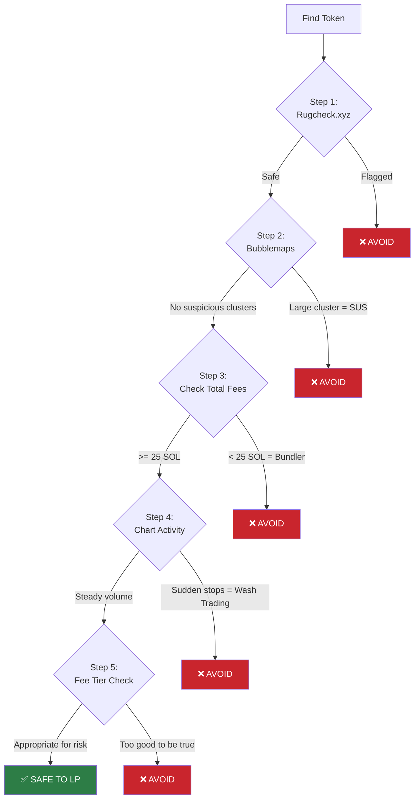
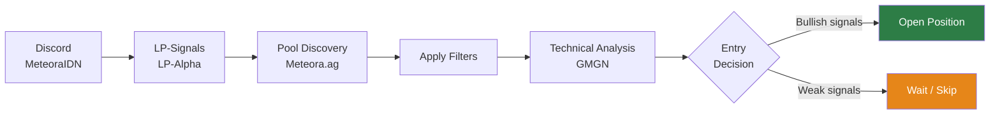
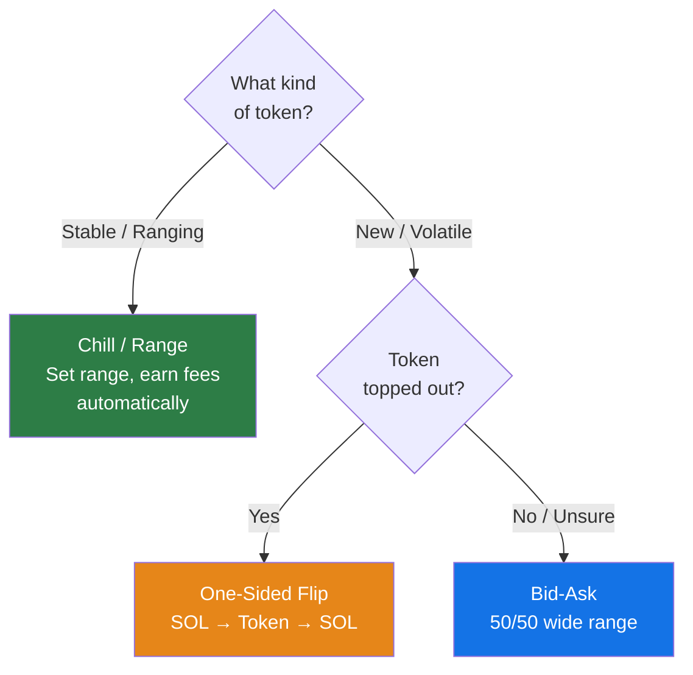
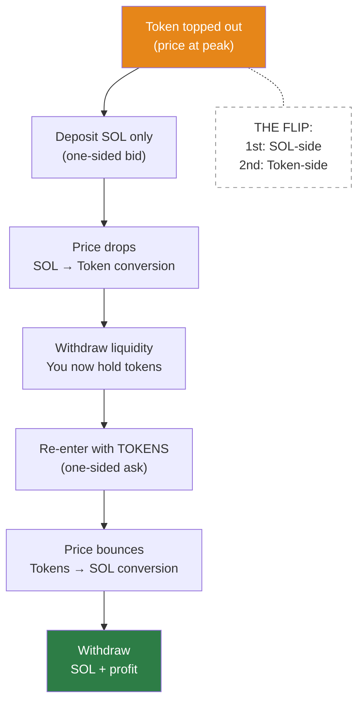

> **Prerequisites:** This guide assumes you've completed Day 0 and understand DLMM basics (bins, distributions, impermanent loss).

## Advanced Strategies Overview

### Mentor's Strategy

- **Wide range** distribution with 50% token / 50% SOL in a **bid-ask** layout, then **spot**

### Evil Panda's Strategy

- Go **one-sided SOL** (quote token only) at **-85% to -90%** range
- Use **wide range** distribution
- Typically in **100 bin step** pools with **5%–10% fee**
- Target pools with **high volume** — filter 1-hour volume > 100K, or for quick plays filter 5-minute volume > 100K
- _Prefer [DEX Screener](https://dexscreener.com) over GMGN for safer analysis_
- Refer to **Advanced Bootcamp #7** for detailed parameters

## Security & Risk Management (Advanced)

Building on Day 0's basic safety checks, here's the professional workflow for vetting tokens and pools.

### Professional Token Vetting Workflow

### Security Tools & What They Tell You

#### [Rugcheck.xyz](https://rugcheck.xyz)

- Scans smart contract for rug pull indicators
- Checks for mint authority, freeze authority, and other red flags
- **Action:** If flagged, skip the token entirely

#### [Bubblemaps](https://bubblemaps.io)

- Visualizes holder relationships and wallet clustering
- Reveals hidden concentration and insider holdings
- **Warning sign:** Large clusters holding high percentages (whale manipulation)

### Advanced Red Flags

Beyond Day 0 basics, watch for:

1. **Wash Trading Detection**
   - Chart shows high volume, then activity suddenly stops
   - Likely bot-driven volume that halted due to errors
   - Check: Look for consistent, organic trading patterns

2. **Bundler Pools**
   - Total fees below **25 SOL** (check on GMGN)
   - Indicates single-transaction bundled orders, not real trading
   - Action: Avoid these pools

3. **Suspicious Volume Patterns**
   - Sudden spikes followed by silence
   - All trades roughly the same size
   - Trading concentrated in short windows

## Professional Tools & Resources

### Analytics & Learning Platforms

- **[LP Army](https://lparmy.com)** — Bootcamp platform for learning DLMM strategies
- **[Metlex](https://metlex.io)** — Discover trending tokens, fees, and PnL data
- **[Meteora Profit Analysis](https://geeklad.github.io/meteora-profit-analysis/)** — Wallet-level profit analysis
- **[UltraLP](https://www.ultralp.com/)** — PnL analysis tool
- **[HawkFi](https://www.hawkfi.ag/)** — LP management assistant
- **[MetEngine](https://www.metengine.xyz/)** — LP analytics tool
- **[Fabriq](https://fabriq.trade/trending)** — Meteora score tracker; look for scores **above 200** (indicates high trading volume + activity)

## Token Discovery Workflows

### Community Signal Sources

**Discord Channels (MeteoraIDN):**

#### #LP-Signals

- Multiday opportunities
- Exotic pairs
- Community-vetted picks

#### #LP-Alpha

- **Degen Calls** — Curated picks from experienced LPs
- **Multiday Degens** — Tokens with multi-day hold potential
- **Degen DLMM** — High-risk, high-reward opportunities

> **Important:** Always perform your own vetting workflow (above) even on community signals.

### Professional Discovery Flow

### Pool Discovery (on Meteora.ag)

Recommended filters:

- **Jupiter Score** >= 70
- **Market Cap** >= 250K
- **Holders** >= 500
- **Pool type** — DLMM only
- **Volume** >= 1K (or 24H volume >= 1M)

### Technical Analysis (use GMGN)

1. **MACD** — Blue crosses above orange = bullish; orange crosses above blue = bearish
2. **RSI** — Standard overbought/oversold signals
3. **Heikin Ashi candles** — Smoothed candlesticks for clearer trend visualization
4. **Volume Profile Visible Range (VPVR)** — Chart overlay showing volume distribution at each price level

## DLMM Strategies

### Strategy Selection Guide

### Bid-Ask Strategy (Advanced)

As introduced in Day 0, **bid-ask** distribution allows asymmetric liquidity placement. In practice, this means buying or selling incrementally across a price range rather than all at once.

**Key concept:** You're not making one trade—you're setting up multiple automatic trades across different price points.

### One-Sided Flip Strategy

1. Deposit **SOL only** (one-sided) — you _expect the price to drop_
2. As the price drops, your SOL gradually buys the token at decreasing prices — think of it as "I want to buy this token, but in small increments"
3. Best used when a token appears to have **topped out**
4. Once the price has dropped and your SOL has converted to tokens, **withdraw liquidity**
5. Re-enter with the **acquired tokens** (one-sided token deposit), now expecting a bounce
6. This is the **flip** — first SOL-side, then token-side

### Chill / Range Strategy

- Best for **stable or ranging tokens** where you can identify a reliable price range
- Uses **curve** or **spot** distribution (from Day 0) to capture fee revenue
- Set your range and let the position earn fees as price oscillates within it
- No manual flipping needed — the position automatically earns as price moves within range
- Lower risk, steadier returns compared to directional plays

## Tips & Rules

### Earnings Expectations

- **20–30% daily return on 1 SOL** is achievable, but _only with a conservative, safe approach_

### Professional Risk Management Rules

Building on Day 0's golden rules, here are advanced principles from experienced LPs:

**Evil Panda's Rule:**

- Prioritize **total fees** and **volume** above all other metrics
- Total fees generated = reliable proxy for pool quality
- This single metric covers most of your analysis needs

**Core Principles:**

1. _Research first, ape later_
2. If you miss an entry, there's always another opportunity
3. Cutting losses quickly preserves capital for better opportunities
4. Position sizing matters more than win rate

### Position Sizing

- Better to go **single-side SOL** — when you sense the top, deploy immediately
- Combine with **MACD + VPVR** and other indicators for timing
- Define your lifestyle: a **1 SOL bid-ask** position is a solid starting point

### Fee Selection Strategy (Advanced)

Building on Day 0's basic fee guidelines, here's the professional approach:

**Established Tokens (3+ days old):**

- Wide range up to 90%
- Fee tier: **2%** is safe
- Lower risk, more predictable returns
- Focus on volume over fee percentage

**New/Volatile Tokens:**

- Use **5–10% fee** pools
- Higher fees compensate for risk
- Expect wider price swings
- Total pool fees should still be >= 25 SOL

**High-Volume Major Pairs:**

- Can use **0.2%–0.5%** fees
- Examples: SOL/USDC, established tokens
- Competitive landscape requires lower fees
- Make profit through volume, not fee percentage

### Timeframe Reference

- **Yunus's timeframe**: 15-minute candles / 30-second intervals
- **Multiday** = hold for days; **Multihour** = hold for hours

### Cut-Loss Rules

- Wrong token pick, oversized bundle, bad chart read — **cut immediately**
- Exit signal triggered but price dumps — _stay consistent, don't hesitate_

### Timing Rules

- _Do not open positions in the afternoon (2–3 PM)_ — you'd have to close them in the morning
- **Open at 10–11 PM** when the chart is still near **ATH**
