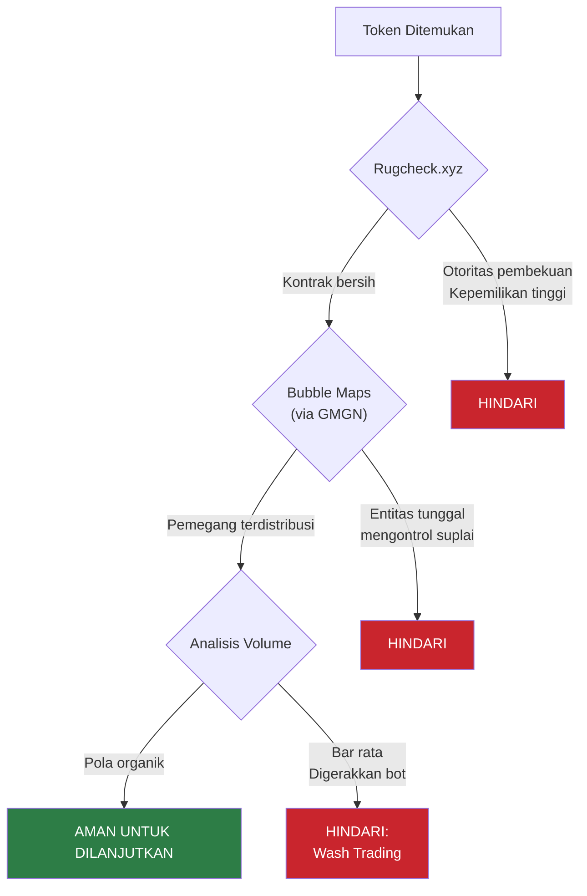
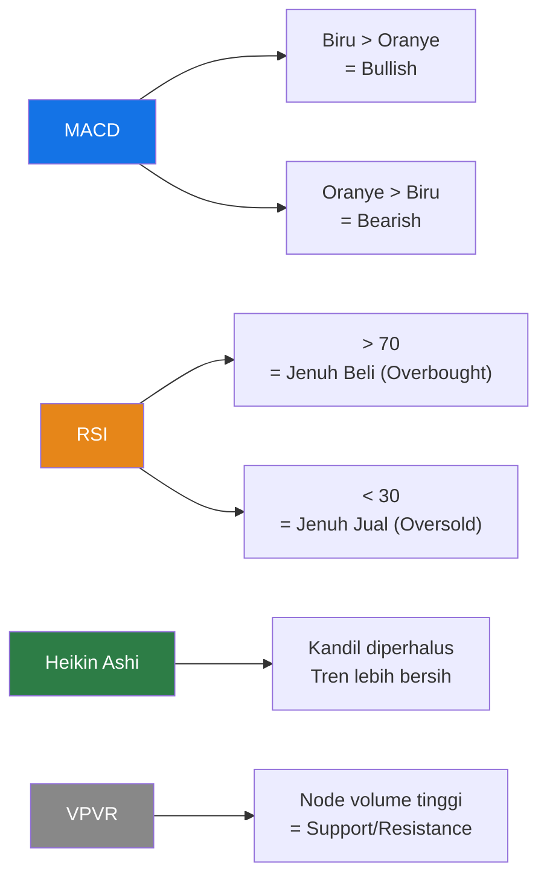
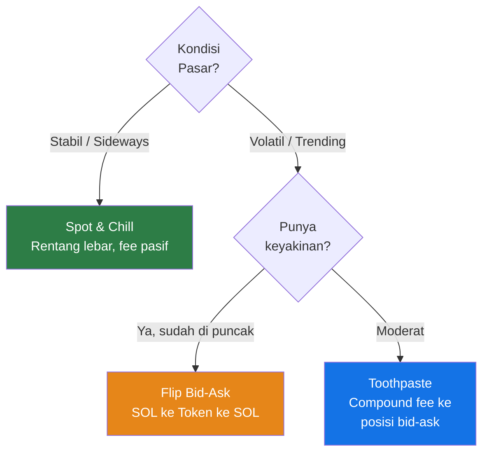
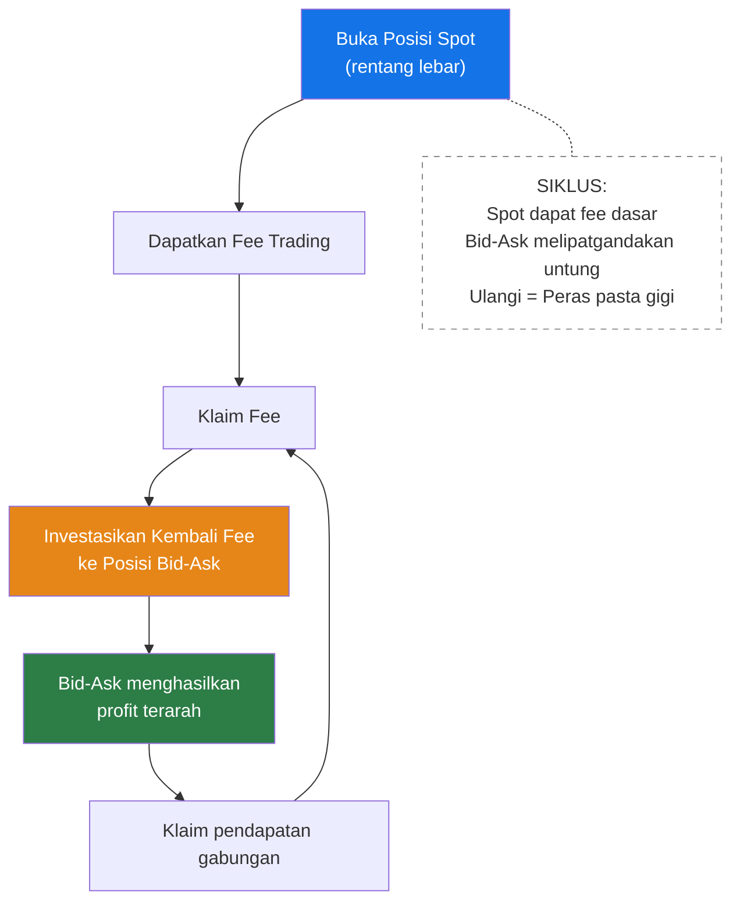
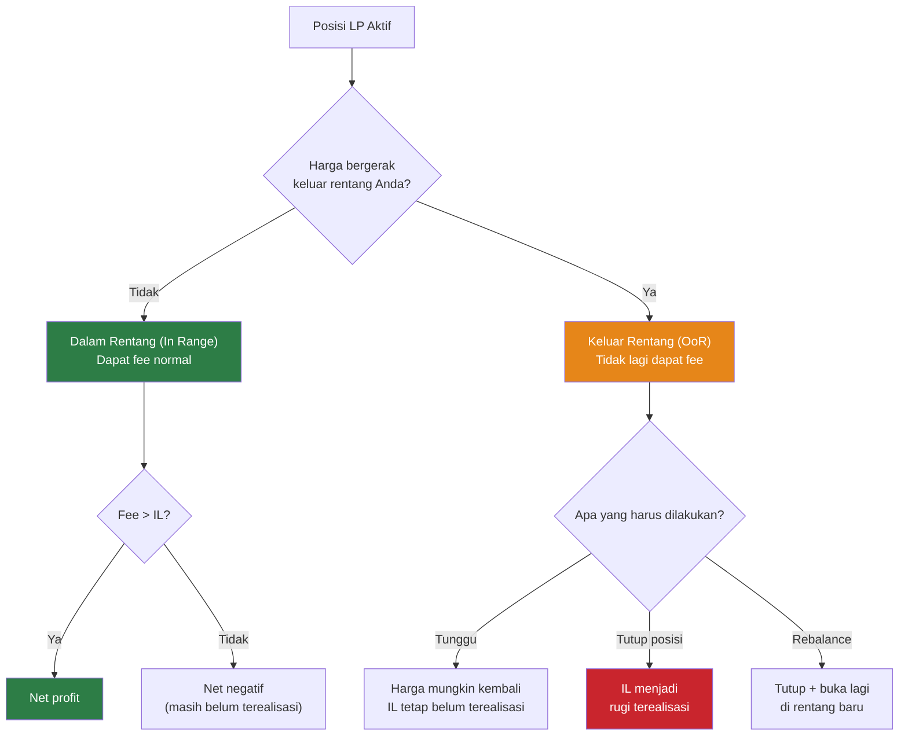
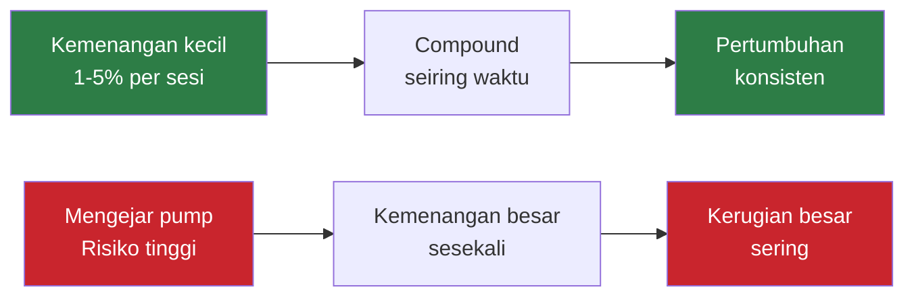
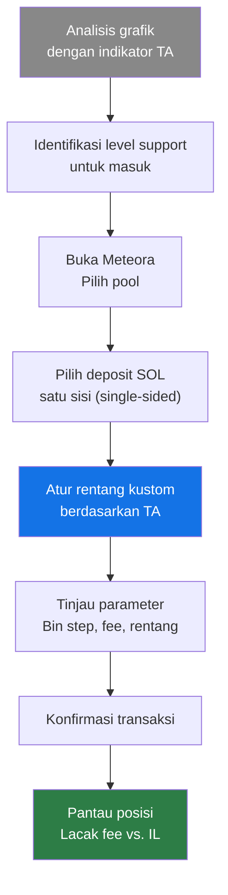

> **Prasyarat:** Panduan ini mengasumsikan Anda telah menyelesaikan Hari 1 (dasar-dasar DLMM) dan Hari 2 (strategi lanjutan dan alur kerja keamanan).

## Gambaran Umum Sesi

Sesi bootcamp dipimpin oleh instruktur Pesal dan Megumi, dengan penampilan tamu dari Evil Panda (Logical TA), pemimpin Meteora Indonesia. Sesi ini mengalihkan fokus dari teori ke **eksekusi langsung (hands-on)** — menerapkan strategi dalam posisi nyata dan membangun disiplin untuk mengelola risiko.

> **Penafian:** Semua konten hanya untuk tujuan pendidikan. Kelola risiko Anda sendiri dan hanya investasikan apa yang Anda mampu untuk kehilangan.

## Analisis Token & Alat Keamanan (Ditinjau Kembali)

Membangun dari alur kerja pemeriksaan profesional Hari 2, sesi ini memperkuat pemeriksaan keamanan kritis dengan demonstrasi langsung.

### Demo Keamanan Langsung

**Poin-poin utama dari demo langsung:**

- **Rugcheck.xyz** — Mengidentifikasi tanda bahaya dalam kontrak token: otoritas pembekuan (freeze authority), otoritas pencetakan (mint authority), dan konsentrasi kepemilikan tinggi.
- **Bubble Maps** (via GMGN) — Memvisualisasikan kluster dompet untuk mendeteksi jika satu entitas mengendalikan sebagian besar pasokan.
- **Analisis bar volume** — Bar volume yang rata atau seragam secara mencurigakan menunjukkan _wash trading_ yang digerakkan oleh bot, membuat token tidak aman untuk LP.

## Analisis Teknikal untuk LP

Hari 2 memperkenalkan indikator utama. Sesi ini berfokus pada **penerapannya untuk keputusan masuk (entry) posisi**.

### Referensi Cepat Indikator

### Support & Resistance dalam Praktik

Mengidentifikasi node volume tinggi pada VPVR membantu LP menempatkan rentang (range) dengan lebih efektif:

- **Level Support** — Zona volume tinggi di bawah harga saat ini bertindak sebagai titik masuk potensial untuk strategi **bid-ask**.
- **Level Resistance** — Zona volume tinggi di atas harga saat ini menunjukkan di mana tekanan jual mungkin meningkat.
- **Menggabungkan indikator** — Gunakan MACD + RSI + VPVR bersama-sama untuk menentukan waktu masuk posisi, bukan hanya satu indikator saja.

## Strategi DLMM Lanjutan (Fokus Eksekusi)

### Pemilihan Strategi

### Strategi Bid-Ask (Detail Eksekusi)

Seperti yang dibahas di Hari 2, strategi bid-ask menempatkan likuiditas satu sisi untuk membeli atau menjual secara bertahap. Sesi ini menekankan pada spesifikasi eksekusi:

1. **Masuk SOL-saja** pada level harga di bawah pasar saat ini ("bid" Anda).
2. Saat harga turun, SOL secara bertahap dikonversi ke token — Anda membeli saat harga turun (_buying the dip_) dalam kenaikan kecil.
3. Setelah harga turun dan SOL telah sepenuhnya dikonversi, **tarik likuiditas**.
4. **Masuk kembali dengan token** (ask satu sisi), memposisikan untuk pantulan harga (_rebound_).
5. Saat harga memantul, token dikonversi kembali menjadi SOL — Anda menjual dalam kenaikan kecil.
6. **Tarik** — Anda sekarang memegang SOL ditambah keuntungan dari selisih harga (_spread_).

> **Wawasan kunci:** Anda tidak melakukan satu perdagangan — Anda menyiapkan puluhan perdagangan mikro otomatis di seluruh rentang Anda.

### Metode "Toothpaste" (Pasta Gigi)

Strategi _compounding_ yang menginvestasikan kembali pendapatan fee ke dalam posisi terarah (directional):

**Cara kerjanya:**

1. Buka posisi **spot** standar pada pool yang Anda nyaman.
2. Saat fee terakumulasi, **klaim fee tersebut**.
3. Ambil fee tersebut dan buka posisi **bid-ask** yang lebih kecil — ini adalah "perasan"-nya.
4. Posisi bid-ask menangkap pergerakan terarah, melipatgandakan (_compounding_) pendapatan Anda.
5. Ulangi siklus ini — setiap putaran menambahkan lebih banyak modal ke mesin _compounding_ Anda.

> **Mengapa "Toothpaste" (Pasta Gigi)?** Seperti memeras tabung pasta gigi — Anda mengekstrak setiap nilai terakhir dari fee yang Anda peroleh dengan menginvestasikannya kembali ke posisi dengan efisiensi lebih tinggi.

### Strategi Spot & Chill (Diperluas)

Pendekatan pasif bagi mereka yang lebih menyukai perawatan minimal:

- Sebarkan likuiditas pada **rentang lebar** (misalnya, -57% hingga -95% dari harga saat ini).
- Dapatkan fee dengan **manajemen aktif minimal**.
- Mengurangi risiko **keluar rentang (out of range)** karena penyebaran yang luas.
- Paling cocok untuk token dengan **aksi harga yang mapan dan bergerak menyamping (ranging)**.
- _Trade-off_: Efisiensi modal lebih rendah vs. lebih sedikit waktu yang dihabiskan untuk memantau.

## Manajemen Risiko & Rencana Keluar (Exit Plans)

### Impermanent Loss vs. Out of Range

**Perbedaan utama:**

- **Impermanent Loss (IL)** — Perbedaan antara memegang token vs. menyediakan likuiditas. Ini "tidak permanen" karena bisa berbalik jika harga kembali ke titik masuk Anda.
- **Out of Range (OoR)** — Posisi Anda tidak lagi berada dalam rentang perdagangan aktif dan berhenti mendapatkan fee. Kerugian hanya menjadi **permanen** jika Anda menutup posisi atau harga tidak pernah pulih.
- **Titik keputusan:** Saat OoR, evaluasi apakah token memiliki volume dan narasi yang cukup untuk pulih. Jika tidak, potong kerugian Anda (_cut loss_).

### Disiplin Cut-Loss

Salah satu keterampilan paling kritis untuk LP yang menguntungkan:

**Kapan harus cut:**

- Volume perdagangan token mengering.
- Narasi atau _hype_ di sekitar token mati.
- Sinyal analisis teknikal Anda salah.
- Grafik menunjukkan tren turun yang berkelanjutan tanpa support.

**Aturan:**

1. **Jangan serakah** — Terima kerugian kecil untuk mempertahankan modal demi peluang yang lebih baik.
2. **Jangan menahan aset rugi (holding bags)** — Keterikatan emosional pada posisi adalah musuh profitabilitas.
3. **Tetap konsisten** — Jika sinyal keluar Anda terpicu, eksekusi segera tanpa mempedulikan harapan.
4. **Salah pilih = keluar segera** — Bundel terlalu besar, pembacaan grafik yang buruk, atau tesis yang gagal harus memicu _cut-loss_ instan.

### Strategi Ambil Untung (Profit Taking)

- Targetkan **profit 1-5% per sesi** daripada mengejar _pump_ besar-besaran.
- Keuntungan kecil dan konsisten **berlipat ganda (compound)** secara signifikan seiring waktu.
- Puas dengan pengembalian moderat adalah **pola pikir profesional**, bukan keterbatasan.

## Panduan Posisi Langsung (Walkthrough)

### Membuka Posisi SOL Satu Sisi

**Proses langkah demi langkah yang didemonstrasikan secara langsung:**

1. **Analisis grafik** — Gunakan MACD, RSI, dan VPVR untuk mengidentifikasi waktu masuk.
2. **Identifikasi level support** — Temukan di mana node volume tinggi menyarankan dasar harga.
3. **Pilih pool di Meteora** — Pilih pasangan perdagangan dan bin step.
4. **Deposit SOL saja** (satu sisi) — Posisikan untuk pergerakan harga ke dalam rentang Anda.
5. **Atur rentang kustom** — Berdasarkan TA Anda, bukan persentase sembarangan.
6. **Tinjau dan konfirmasi** — Periksa bin step, tingkat fee, dan lebar rentang sebelum menandatangani.
7. **Pantau** — Lacak akumulasi fee terhadap _impermanent loss_.

## Tugas Bootcamp

### Persyaratan PR

Peserta harus menyelesaikan hal berikut agar memenuhi syarat untuk peran bootcamp berikutnya:

| Persyaratan         | Detail                  |
| ------------------- | ----------------------- |
| **Tipe posisi**     | Pasangan non-stablecoin |
| **Deposit minimum** | Setara $15              |
| **Durasi tahan**    | Minimal 1 jam           |
| **Target profit**   | Return minimal 5%       |

> **Tujuan:** Tugas ini memaksa peserta untuk menerapkan semua yang dipelajari selama Hari 1-3 — pemeriksaan token, analisis teknikal, pemilihan strategi, dan manajemen posisi — dalam skenario nyata dengan modal nyata yang dipertaruhkan.

### Sumber Daya Komunitas

- **Meteora Discord** — Pembaruan platform resmi, dukungan, dan pengumuman.
- **LP Army Discord** — Pelatihan berkelanjutan, pilihan komunitas, dan "calls" untuk token LP potensial.
- **MeteoraIDN Discord** — Komunitas Indonesia dengan saluran LP-Signals dan LP-Alpha (lihat Hari 2).
