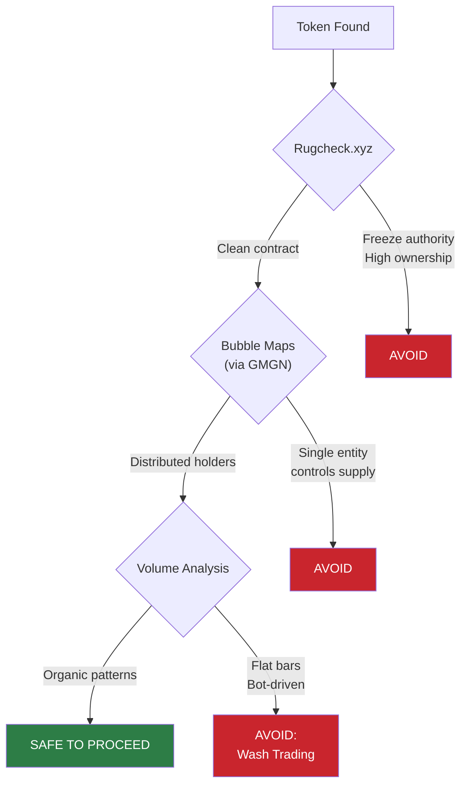
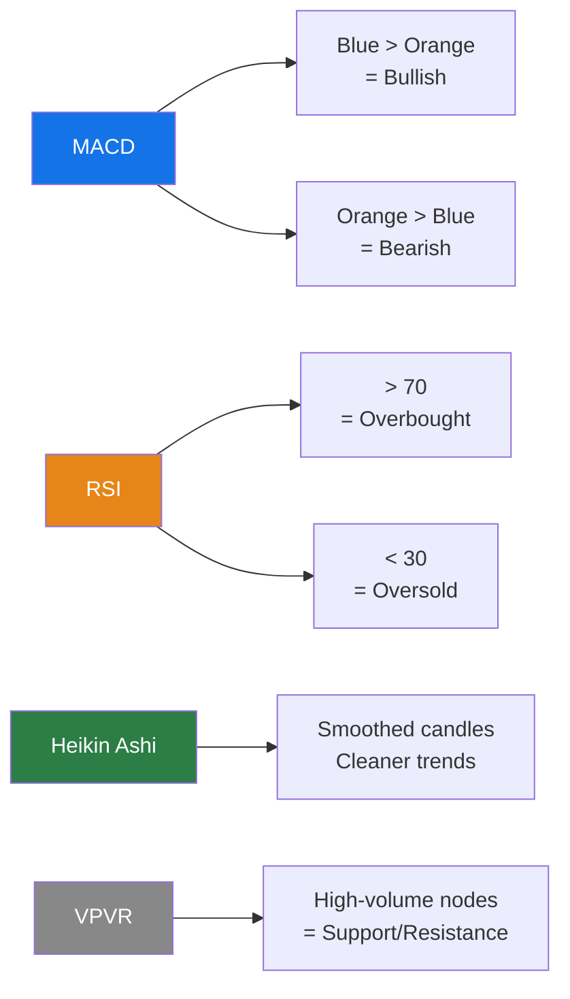
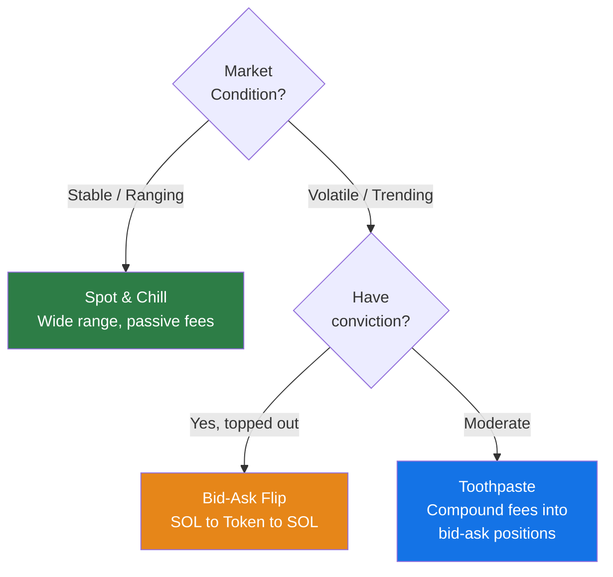
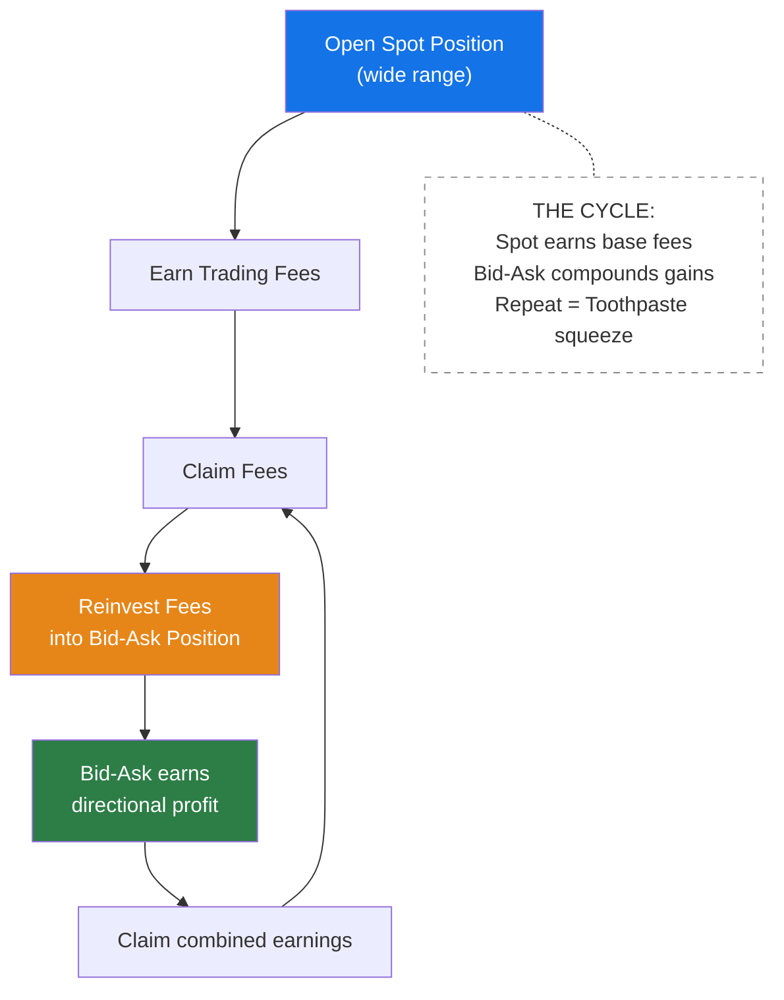
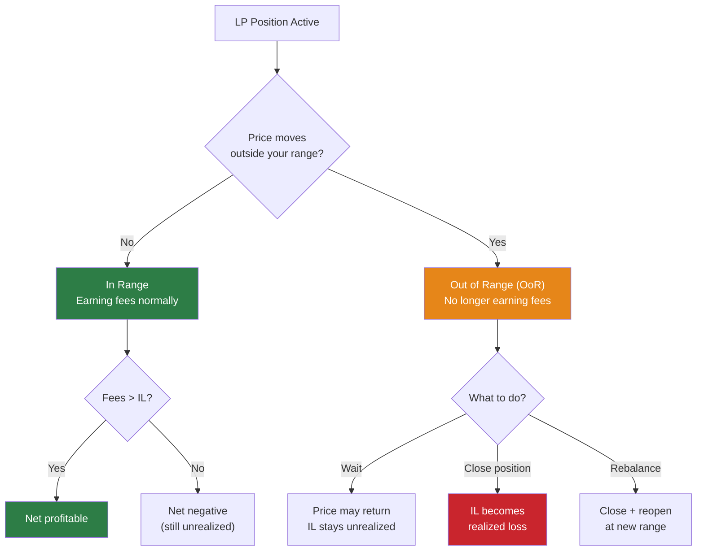
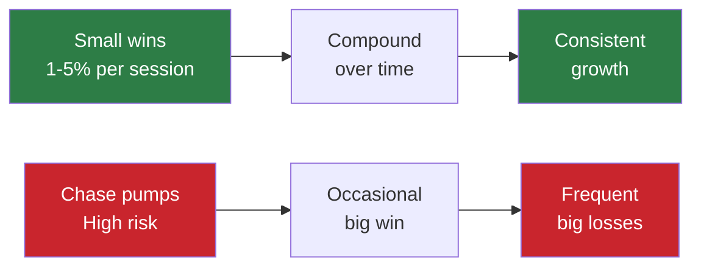
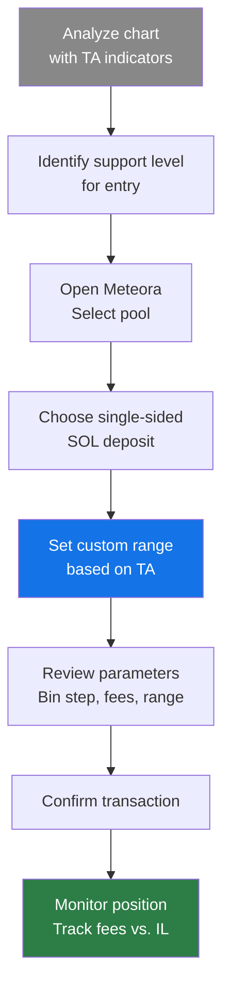

> **Prerequisites:** This guide assumes you've completed Day 1 (DLMM basics) and Day 2 (advanced strategies and security workflows).

## Session Overview

Bootcamp session led by instructors Pesal and Megumi, with a guest appearance from Evil Panda (Logical TA), lead of Meteora Indonesia. This session shifts focus from theory to **hands-on execution** — applying strategies in real positions and building the discipline to manage risk.

> **Disclaimer:** All content is for educational purposes only. Manage your own risk and only invest what you can afford to lose.

## Token Analysis & Safety Tools (Revisited)

Building on Day 2's professional vetting workflow, this session reinforces the critical safety checks with live demonstrations.

### Live Safety Demo

**Key takeaways from the live demo:**

- **Rugcheck.xyz** — Identifies red flags in token contracts: freeze authority, mint authority, and high ownership concentration
- **Bubble Maps** (via GMGN) — Visualizes wallet clusters to detect if a single entity controls a large portion of supply
- **Volume bar analysis** — Suspiciously flat or uniform volume bars indicate bot-driven wash trading, making the token unsafe for LP

## Technical Analysis for LP

Day 2 introduced the key indicators. This session focuses on **applying them to position entry decisions**.

### Indicator Quick Reference

### Support & Resistance in Practice

Identifying high-volume nodes on the VPVR helps LPs place ranges more effectively:

- **Support levels** — High-volume zones below current price act as potential entry points for **bid-ask** strategies
- **Resistance levels** — High-volume zones above current price indicate where selling pressure may increase
- **Combining indicators** — Use MACD + RSI + VPVR together to time position entries, not just one indicator alone

## Advanced DLMM Strategies (Execution Focus)

### Strategy Selection

### Bid-Ask Strategy (Execution Detail)

As covered in Day 2, the bid-ask strategy places single-sided liquidity to buy or sell incrementally. This session emphasizes the execution specifics:

1. **Enter SOL-only** at a price level below the current market (your "bid")
2. As price drops, SOL gradually converts to the token — you're buying the dip in small increments
3. Once price has dropped and SOL has fully converted, **withdraw liquidity**
4. **Re-enter with tokens** (single-sided ask), positioning for the rebound
5. As price bounces, tokens convert back to SOL — you're selling in small increments
6. **Withdraw** — you now hold SOL plus profit from the spread

> **Key insight:** You're not making one trade — you're setting up dozens of automatic micro-trades across your range.

### The "Toothpaste" Method

A compounding strategy that reinvests fee earnings into directional positions:

**How it works:**

1. Open a standard **spot** position on a pool you're comfortable with
2. As fees accumulate, **claim them**
3. Take those fees and open a smaller **bid-ask** position — this is the "squeeze"
4. The bid-ask position captures directional movement, compounding your earnings
5. Repeat the cycle — each round adds more capital to your compounding engine

> **Why "Toothpaste"?** Like squeezing a tube — you extract every last bit of value from your earned fees by reinvesting them into higher-efficiency positions.

### Spot & Chill Strategy (Expanded)

A passive approach for those who prefer lower maintenance:

- Spread liquidity over a **wide range** (e.g., -57% to -95% from current price)
- Earn fees with **minimal active management**
- Reduces risk of going **out of range** due to the wide spread
- Best suited for tokens with **established, ranging price action**
- Trade-off: Lower capital efficiency vs. less time spent monitoring

## Risk Management & Exit Plans

### Impermanent Loss vs. Out of Range

**Key distinction:**

- **Impermanent Loss (IL)** — The difference between holding tokens vs. providing liquidity. It's "impermanent" because it reverses if the price returns to your entry point
- **Out of Range (OoR)** — Your position is no longer in the active trading range and stops earning fees. The loss only becomes **permanent** if you close the position or the price never recovers
- **Decision point:** When OoR, evaluate whether the token has enough volume and narrative to recover. If not, cut your losses

### Cut-Loss Discipline

One of the most critical skills for profitable LP:

**When to cut:**

- Token's trading volume dries up
- The narrative or hype around the token dies
- Your technical analysis signals were wrong
- The chart shows a sustained downtrend with no support

**Rules:**

1. **Don't be greedy** — Accept small losses to preserve capital for better opportunities
2. **Don't hold losing bags** — Emotional attachment to a position is the enemy of profitability
3. **Stay consistent** — If your exit signal triggers, execute immediately regardless of hope
4. **Wrong pick = immediate exit** — Oversized bundles, bad chart reads, or failed thesis should trigger instant cut-loss

### Profit Taking Strategy

- Target **1-5% profit per session** rather than chasing massive pumps
- Small, consistent gains **compound significantly** over time
- Being content with modest returns is a **professional mindset**, not a limitation

## Live Position Walkthrough

### Opening a Single-Sided SOL Position

**Step-by-step process demonstrated live:**

1. **Analyze the chart** — Use MACD, RSI, and VPVR to identify entry timing
2. **Identify support level** — Find where high-volume nodes suggest price floor
3. **Select pool on Meteora** — Choose the trading pair and bin step
4. **Deposit SOL only** (single-sided) — Position for price movement into your range
5. **Set custom range** — Based on your TA, not arbitrary percentages
6. **Review and confirm** — Check bin step, fee tier, and range width before signing
7. **Monitor** — Track fee accumulation against impermanent loss

## Bootcamp Assignment

### Homework Requirements

Participants must complete the following to qualify for the next bootcamp role:

| Requirement         | Detail              |
| ------------------- | ------------------- |
| **Position type**   | Non-stablecoin pair |
| **Minimum deposit** | $15 equivalent      |
| **Hold duration**   | At least 1 hour     |
| **Profit target**   | Minimum 5% return   |

> **Purpose:** This assignment forces participants to apply everything learned across Days 1-3 — token vetting, technical analysis, strategy selection, and position management — in a real scenario with real capital at stake.

### Community Resources

- **Meteora Discord** — Official platform updates, support, and announcements
- **LP Army Discord** — Ongoing coaching, community picks, and "calls" for potential LP tokens
- **MeteoraIDN Discord** — Indonesian community with LP-Signals and LP-Alpha channels (see Day 2)
