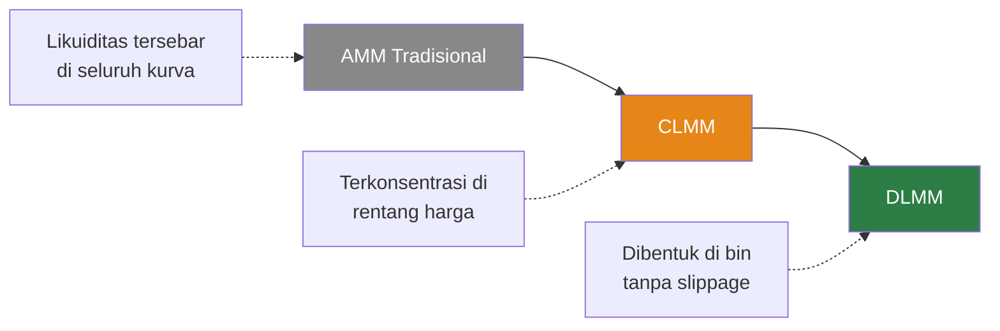
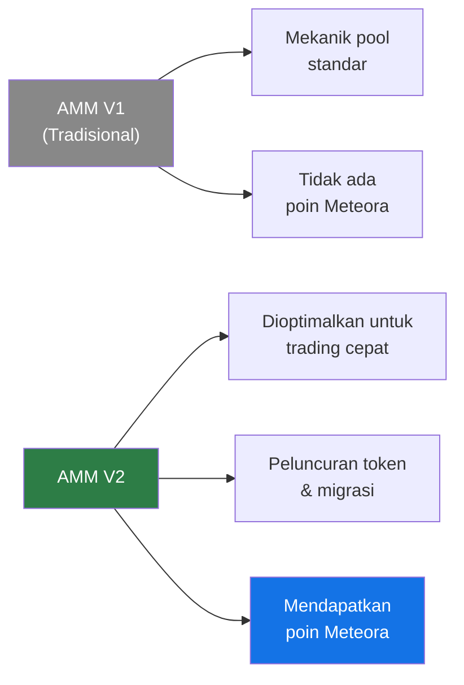
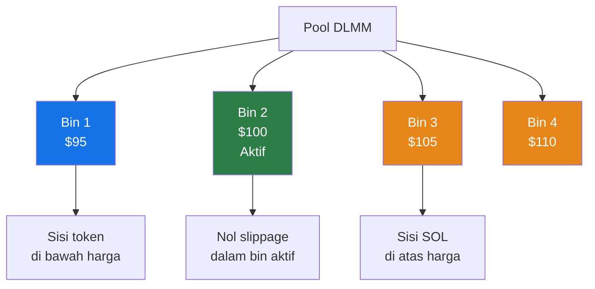
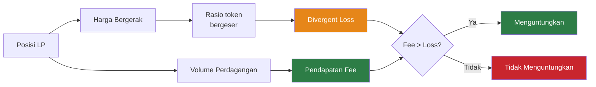
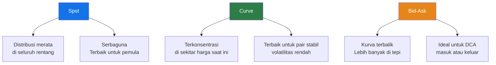
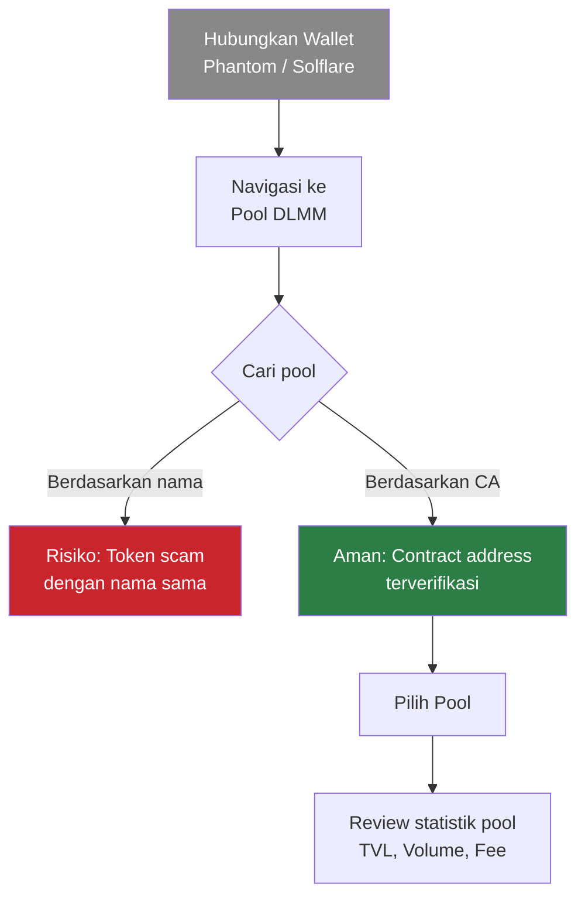
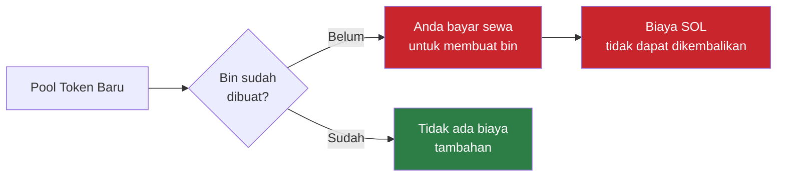
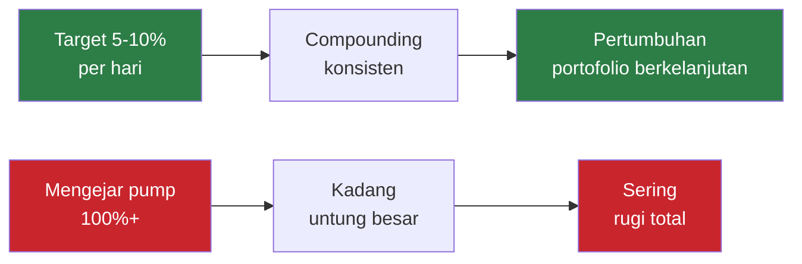

> **Sumber:** [Meteora LP Army Bootcamp - Indonesia - Hari 1](http://www.youtube.com/watch?v=69IqNJ32m0w) — Dipandu oleh mentor Yunus, Megumi (Zero Xumi), dan Mas Beng.

## Pengantar & Disclaimer

Mentor Yunus, Megumi, dan Mas Beng memperkenalkan hari pertama **"Garuda Army Bootcamp"** Indonesia untuk Meteora. Sesi ini murni untuk tujuan edukasi dan **tidak** menjamin airdrop, alokasi, atau NFT apapun.

> **Peringatan Risiko:** Yunus menegaskan bahwa konten ini bukan merupakan saran finansial. Peserta harus melakukan riset sendiri dan hanya menginvestasikan dana yang benar-benar siap mereka relakan jika hilang.

## Terminologi DeFi Utama

Yunus menjelaskan terminologi DeFi esensial bagi pemula yang memasuki ekosistem DLMM:

- **Contract Address (CA)** — Identitas unik sebuah token di blockchain; selalu verifikasi melalui sumber resmi sebelum berinteraksi
- **Slippage** — Selisih harga antara saat transaksi dimulai dan saat dieksekusi
- **TVL (Total Value Locked)** — Total modal yang disimpan dalam sebuah protokol atau pool
- **Volume** — Aktivitas perdagangan yang mengalir melalui pool; berpengaruh langsung pada pendapatan fee LP
- **Volatilitas** — Besarnya pergerakan harga; volatilitas tinggi berarti fee dinamis lebih besar tetapi risiko impermanent loss juga meningkat

## Evolusi: AMM ke CLMM ke DLMM

- **AMM (Automated Market Maker)** — Likuiditas tersebar di seluruh kurva harga; sederhana tetapi tidak efisien secara modal
- **CLMM (Concentrated Liquidity Market Maker)** — Memungkinkan pengguna mengonsentrasikan dana pada rentang harga tertentu; penggunaan modal lebih efisien dan fee lebih tinggi
- **DLMM (Dynamic Liquidity Market Maker)** — Inovasi Meteora: likuiditas dibentuk di bin-bin diskret dengan nol slippage dan penyesuaian fee dinamis

### Meteora V1 vs V2

Mas Beng menjelaskan perbedaan antara dua versi AMM Meteora:

- **V1 (AMM Tradisional)** — Mekanik pool standar, tanpa insentif tambahan
- **V2 (AMM Dinamis)** — Sangat efektif untuk skenario trading cepat seperti peluncuran token atau migrasi; juga memberikan **poin Meteora** kepada pengguna, tidak seperti V1

## Mekanik DLMM Secara Mendalam

### Bin dan Binstep

Yunus menjelaskan bahwa likuiditas disimpan dalam **bin harga** yang diskret. Jarak antar bin disebut **binstep**, yang menentukan granularitas cakupan harga.

**Properti utama:**

- Setiap bin menyimpan likuiditas pada titik harga diskret
- Perdagangan dieksekusi dengan **nol slippage** dalam satu bin
- Pasar yang sangat volatil memicu **fee dinamis**, meningkatkan imbal hasil LP saat harga berfluktuasi cepat
- Likuiditas satu sisi (single-sided) didukung — deposit hanya satu jenis token, bukan sepasang

### Impermanent (Divergent) Loss

Yunus menjelaskan secara detail bahwa menyediakan likuiditas secara inheren melibatkan **divergent loss** karena token yang disetorkan bertukar bolak-balik seiring pergerakan pasar. Tujuan utama LP adalah mengumpulkan fee perdagangan yang cukup untuk **melebihi** kerugian bawaan ini.

## Strategi Likuiditas

### Tiga Bentuk Distribusi Utama

Yunus membahas tiga bentuk distribusi utama DLMM:

- **Spot** — Penyebaran seragam di seluruh rentang harga yang dipilih; titik awal paling fleksibel
- **Curve** — Terkonsentrasi di tengah sekitar harga saat ini; terbaik untuk pasar yang ranging atau stabil
- **Bid-Ask** — Kurva terbalik dengan lebih banyak likuiditas di tepi; sangat disukai di Meteora untuk strategi Dollar Cost Averaging (DCA)

> **Tips pro:** Anda bisa **menumpuk beberapa strategi** dalam satu posisi — misalnya, mencampur Bid-Ask dengan Spot untuk pendekatan hybrid yang menggabungkan exit DCA dengan fee capture yang luas.

## Panduan UI Langsung

### Menghubungkan Wallet & Mencari Pool

Mas Beng memimpin demonstrasi langsung antarmuka Meteora:

> **Selalu cari berdasarkan Contract Address (CA)** untuk menghindari token scam berbahaya yang meniru proyek sah dengan nama yang identik.

### Men-deploy Posisi

Mas Beng mendemonstrasikan cara mengatur parameter harga kustom dan men-deploy likuiditas:

1. **Pilih pasangan trading** — Pilih pool dengan bin step yang sesuai untuk strategi Anda
2. **Atur parameter harga** — Tentukan harga minimum dan maksimum kustom untuk rentang likuiditas
3. **Pilih distribusi** — Pilih Spot, Curve, Bid-Ask, atau tumpuk beberapa strategi
4. **Atur jumlah deposit** — Satu sisi (satu token) atau dua sisi (kedua token)
5. **Review dan konfirmasi** — Periksa semua parameter sebelum menandatangani transaksi

## Manajemen Risiko & Insight dari Q&A

### Biaya Sewa Bin yang Tidak Dapat Dikembalikan

Para mentor memperingatkan pengguna agar berhati-hati dengan biaya sewa yang tidak dapat dikembalikan saat membuat bin baru:

Saat berinteraksi dengan **pool token baru**, membuat bin baru memerlukan biaya sewa yang tidak dapat dikembalikan dalam SOL. Mereka menyarankan untuk menunggu LP lain membuat bin terlebih dahulu untuk melindungi modal Anda.

### Aturan Alokasi Modal

- **Jangan pernah** menaruh seluruh portofolio dalam satu posisi likuiditas
- Diversifikasi di beberapa posisi dan pasangan token
- Simpan cadangan untuk peluang dan keadaan darurat

### Kekuatan Compounding

Dalam sesi Q&A, Megumi menekankan bahwa LP di Meteora adalah tentang **compounding yang konsisten** bukan cepat kaya:

Secara konsisten menargetkan **return harian 5% hingga 10%** membangun kekayaan jauh lebih aman dibandingkan berjudi pada meme coin berisiko tinggi. Keuntungan kecil yang konsisten akan ter-compound secara signifikan dari waktu ke waktu.

## Tugas & Sertifikasi

Para mentor menutup hari pertama dengan **kuis wajib**. Peserta harus lulus kuis ini untuk naik level di bootcamp dan mendapatkan peran **"Garuda Army Private"** di komunitas Discord.

> **Poin utama:** Bootcamp ini menekankan *belajar sambil praktik* — pengetahuan teoritis harus divalidasi melalui penerapan praktis dan penilaian sebelum naik level.
