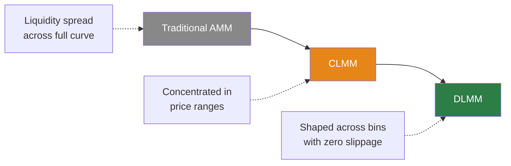
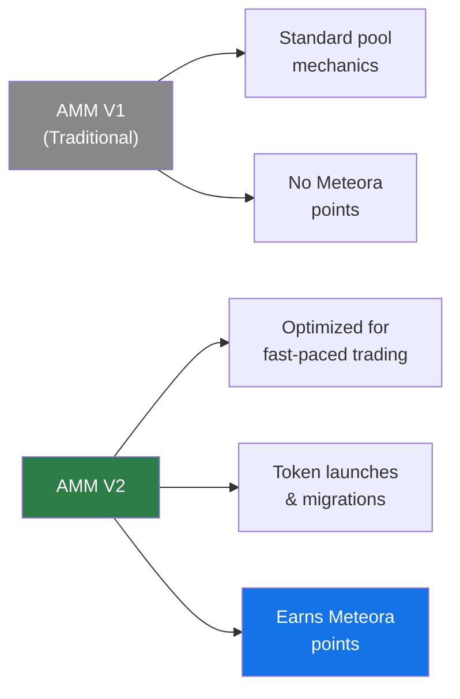
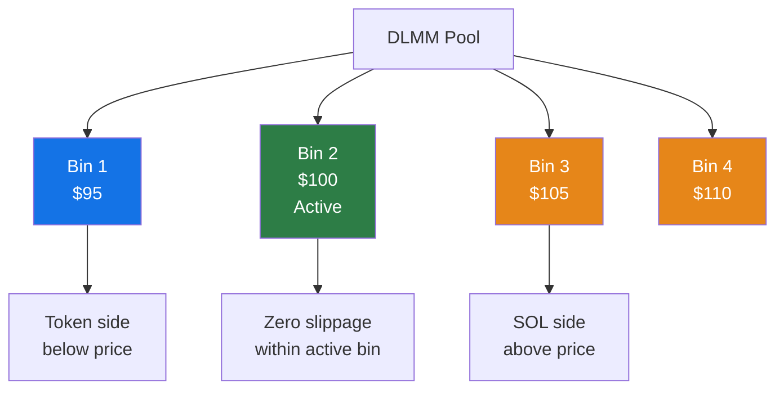
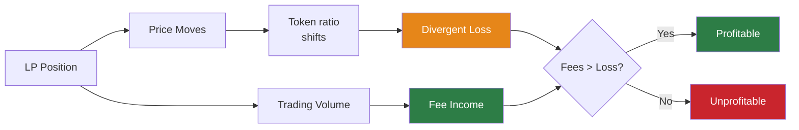
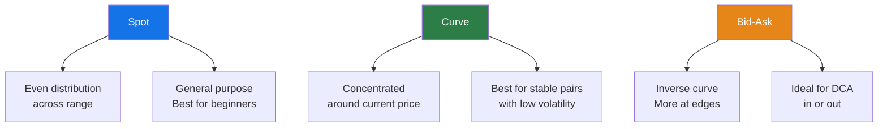
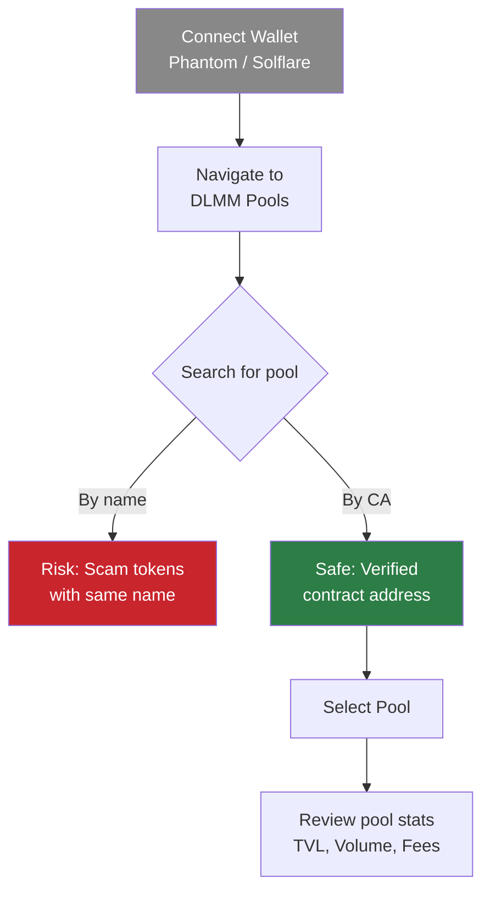
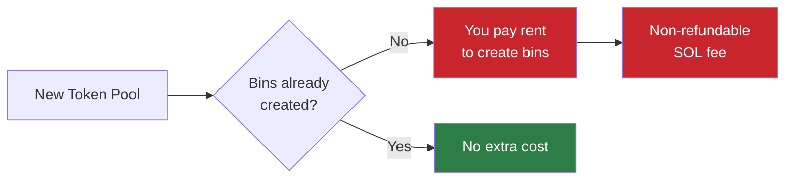
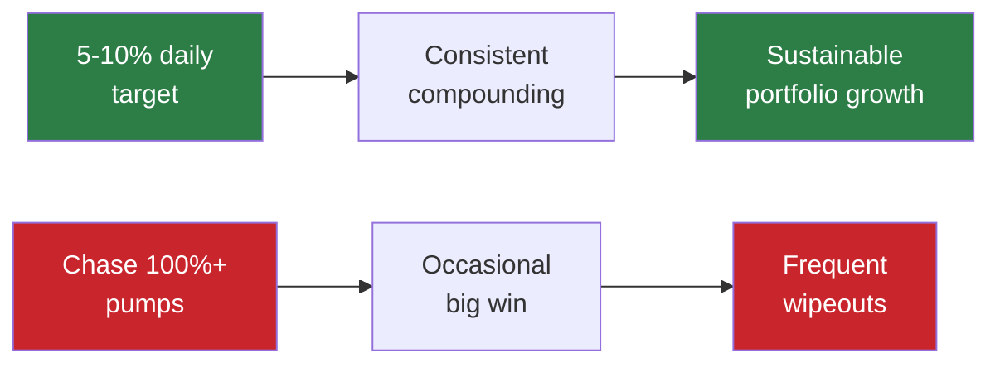

> **Source:** [Meteora LP Army Bootcamp - Indonesia - Day 1](http://www.youtube.com/watch?v=69IqNJ32m0w) — Led by mentors Yunus, Megumi (Zero Xumi), and Mas Beng.

## Introduction & Disclaimers

Mentors Yunus, Megumi, and Mas Beng introduce the first day of the Indonesian **"Garuda Army Bootcamp"** for Meteora. The session is purely for educational purposes and does **not** guarantee any airdrops, allocations, or NFTs.

> **Risk Warning:** Yunus emphasizes that the content is not financial advice. Participants must do their own research and only invest funds they are entirely prepared to lose.

## Key DeFi Terminology

Yunus breaks down essential DeFi terminology for beginners entering the DLMM ecosystem:

- **Contract Address (CA)** — The unique on-chain identifier for a token; always verify via official sources before interacting
- **Slippage** — Price difference between transaction initiation and execution
- **TVL (Total Value Locked)** — Total capital deposited in a protocol or pool
- **Volume** — Trading activity flowing through a pool; directly affects LP fee income
- **Volatility** — Magnitude of price swings; higher volatility means higher dynamic fees but also greater impermanent loss risk

## The Evolution: AMM to CLMM to DLMM

- **AMM (Automated Market Maker)** — Liquidity is spread across the entire price curve; simple but capital-inefficient
- **CLMM (Concentrated Liquidity Market Maker)** — Allows users to concentrate funds in specific price ranges; more efficient capital usage and higher fee generation
- **DLMM (Dynamic Liquidity Market Maker)** — Meteora's innovation: liquidity shaped across discrete bins with zero slippage and dynamic fee adjustment

### Meteora V1 vs V2

Mas Beng explains the distinction between Meteora's two AMM versions:

- **V1 (Traditional AMM)** — Standard pool mechanics, no additional incentives
- **V2 (Dynamic AMM)** — Highly effective for fast-paced trading scenarios such as token launches or migrations; also rewards users with **Meteora points**, unlike V1

## DLMM Mechanics Deep Dive

### Bins and Binsteps

Yunus explains that liquidity is stored in distinct **price bins**. The gap between consecutive bins is called a **binstep**, defining the granularity of price coverage.

**Key properties:**

- Each bin holds liquidity at a discrete price point
- Trades execute with **zero slippage** within a single bin
- Highly volatile markets trigger **dynamic fees**, increasing yield for LPs during rapid price fluctuations
- Single-sided liquidity is supported — deposit just one token type instead of a pair

### Impermanent (Divergent) Loss

Yunus details how providing liquidity inherently involves **divergent loss** as deposited tokens swap back and forth with market movements. The primary goal of LPing is to collect enough trading fees to **outpace** these inherent losses.

## Liquidity Strategies

### Three Primary Distribution Shapes

Yunus covers the three main DLMM distribution shapes:

- **Spot** — Uniform spread across your selected price range; most versatile starting point
- **Curve** — Concentrated in the middle around current price; best for ranging or stable markets
- **Bid-Ask** — Inverse curve with more liquidity at the edges; highly favored on Meteora for Dollar Cost Averaging (DCA) strategies

> **Pro tip:** You can **stack multiple strategies** in a single position — for example, mixing Bid-Ask with Spot for a hybrid approach that combines DCA exits with broad fee capture.

## Live UI Walkthrough

### Connecting & Finding Pools

Mas Beng leads a live demonstration of the Meteora interface:

> **Always search by Contract Address (CA)** to avoid malicious copycat tokens that impersonate legitimate projects with identical names.

### Deploying a Position

Mas Beng demonstrates how to set custom price parameters and deploy liquidity:

1. **Select trading pair** — Choose the pool with the right bin step for your strategy
2. **Set price parameters** — Define custom minimum and maximum price for your liquidity range
3. **Choose distribution** — Select Spot, Curve, Bid-Ask, or stack multiple strategies
4. **Set deposit amount** — Single-sided (one token) or dual-sided (both tokens)
5. **Review and confirm** — Check all parameters before signing the transaction

## Risk Management & Q&A Insights

### Non-Refundable Bin Rent

The mentors warn users to be careful of non-refundable rent fees when creating new bins:

When interacting with **brand-new token pools**, creating new bins requires a non-refundable rent fee in SOL. They suggest waiting for other LPs to create the bins first to protect your capital.

### Capital Allocation Rules

- **Never** put your entire portfolio into a single liquidity position
- Diversify across multiple positions and token pairs
- Keep a reserve for opportunities and emergencies

### The Power of Compounding

During the Q&A, Megumi emphasizes that LPing on Meteora is about **steady compounding** rather than getting rich quickly:

Consistently targeting a **5% to 10% daily return** builds wealth much more safely than gambling on high-risk meme coins. Small, consistent gains compound significantly over time.

## Homework & Certification

The mentors conclude day one with a **mandatory quiz**. Participants must pass this quiz to advance in the bootcamp and earn the **"Garuda Army Private"** role in the Discord community.

> **Key takeaway:** This bootcamp emphasizes *learning by doing* — theoretical knowledge must be validated through practical application and assessment before advancing.
